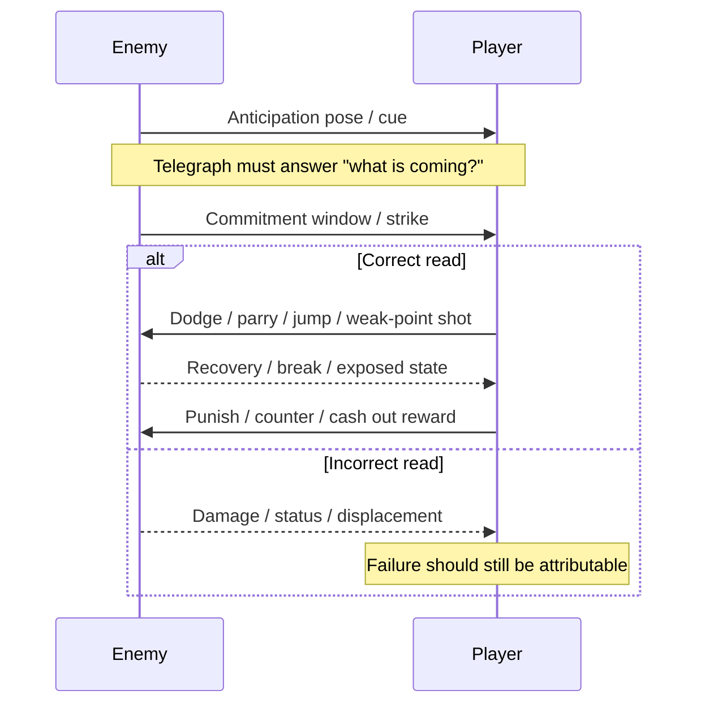
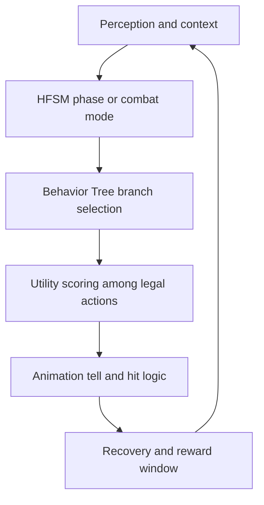

# Algorithms for Enjoyable Enemy Design in Elden Ring and Clair Obscur Expedition 33

## Executive Summary

Enemy design in **Elden Ring** and **Clair Obscur: Expedition 33** pursues the same high-level outcome—mastery that feels earned—but through different combat contracts. In interviews, entity["people","Hidetaka Miyazaki","game director"] describes **Elden Ring** as a game built around adversity, learning, and a sense that difficult encounters should be fair rather than arbitrary; official materials from entity["company","FromSoftware","game studio"] and entity["company","Bandai Namco Entertainment","game publisher"] also emphasize open-ended approaches to combat, including stealth, routing, mounts, and varied builds. By contrast, entity["people","Guillaume Broche","game director"] frames **Clair Obscur: Expedition 33** as an attempt to make turn-based combat feel new via “reactive turn-based” systems, where enemies become timing exams for dodge, parry, jump, weak-point shots, and build execution; official materials from entity["company","Sandfall Interactive","game studio"] and entity["company","Kepler Interactive","game publisher"] repeatedly stress skill reward, pattern mastery, and even the possibility of no-damage play. citeturn6view0turn6view1turn40search1turn41view0turn6view4turn6view5turn12view0turn9search1

The most important commonality is not “difficulty” by itself, but **attributable failure**: players enjoy losing less when they can explain why they lost and what to do next. That principle is visible in Miyazaki’s fairness comments, in Sandfall’s explicit pattern-learning language, in official patch notes that changed visibility and timing windows, and in research linking enjoyment to perceived competence, learnable challenge, and readable telegraphing rather than opaque punishment. citeturn29view0turn6view4turn10search5turn10search7turn32view0turn32view2turn39view0

For implementation, the best practical architecture for these kinds of enemies is **authored behavior with parameterized tuning**: use hierarchical finite state machines for broad phases, behavior trees for modular combat logic, and utility scoring for action selection within the active phase. Use procedural generation chiefly for **encounter assembly** and **varianting**, and use machine learning primarily for **offline tuning**, **player modeling**, or **assistive adaptation**, not as the main real-time boss brain. That approach gives the readability, QA-ability, and designer control both games depend on. citeturn38view6turn38view7turn38view4turn38view5turn30search2turn36search1turn38view0turn38view1

The most actionable design pattern emerging from the comparison is this: **every threatening enemy should ask one main tactical question, signal that question clearly, and reward the correct answer immediately**. In Elden Ring, that usually means spacing, timing, posture breaking, or choosing to disengage and return later. In Clair Obscur, it usually means recognizing a rhythm, selecting the right defense verb, or identifying a weak-point/sub-objective under time pressure. The fun comes from compressing observation, decision, execution, and payoff into a loop that is demanding but legible. citeturn6view0turn6view1turn29view0turn6view4turn6view5turn26view0turn39view0

The report’s prioritized recommendation is therefore straightforward: build enemies around **telegraph clarity, recovery-window quality, sub-objective variety, and low-friction retry loops**, then tune aggression and timing with telemetry-informed parameters. If a studio must choose where to invest, it should invest first in **attack readability**, second in **reward pacing**, third in **aggression control**, and only then in procedural or learning-heavy sophistication. Both games’ official patches strongly imply that this is where “fun” is won or lost in practice. citeturn6view2turn6view3turn10search5turn10search7turn38view9turn39view1

## Comparative Design Goals and Mechanics

At the design-goal level, Elden Ring and Clair Obscur solve different problems. Elden Ring tries to preserve the tension, dread, and triumph of the studio’s earlier work while expanding player agency through open-world routing, stealth, summons, and the option to postpone an encounter. Clair Obscur tries to preserve the strategic planning of turn-based RPGs while injecting continuous attentional demand through real-time defense, timed offense, and weak-point targeting. One game makes encounters fun by widening strategic approach space; the other makes encounters fun by intensifying moment-to-moment execution space. citeturn6view0turn6view1turn41view0turn6view4turn6view5turn12view0turn26view1

| Axis | Elden Ring | Clair Obscur: Expedition 33 | Design implication |
|---|---|---|---|
| Core combat promise | Fair adversity, discovery, and “sense of accomplishment,” with freedom to retreat, reroute, or approach differently. citeturn6view0turn6view1turn29view0 | Reactive turn-based combat where enemy turns still demand real-time skill and pattern mastery. citeturn6view4turn6view5turn9search1 | Enjoyment comes from mastery, but the mastery axis differs: spatial-strategic vs. rhythmic-reactive. |
| Encounter agency | Stealth, mounted combat, summoning, multiplayer aid, and open-world sequence flexibility. citeturn6view0turn41view0turn40search1 | Turn order display, difficulty assists, dodge/parry/jump choices, free aim, and build-specific counters. citeturn6view5turn26view0turn12view0 | More agency usually means more perceived fairness. |
| Failure recovery | Leave and return later; rebuild character; exploit terrain; summon help. citeturn6view0turn6view1 | Nearby respawns, adjustable difficulty, optional QTE assistance, and later a dedicated Battle Retry prompt. citeturn26view0turn10search7 | Retry friction is part of enemy fun, not peripheral UX. |
| Reward pacing | Runes, drops, route access, and progression materials; official patches even increased smithing-stone drops for some enemies. citeturn6view3 | AP economy, weak-point disables, no-damage XP bonus, build unlocks via Pictos/Lumina, rematches for hard bosses. citeturn12view0turn10search5 | Reward should reinforce the behavior the enemy is trying to teach. |
| Difficulty scaffolding | Optional encounters, broad build expression, stealth pulls, and later DLC tuning that adjusted attack patterns, range, damage, and visibility. citeturn6view2turn41view1 | Story Mode timing windows increased by 40% in patch 1.3.0, damage reduced, and later battle retry added in patch 1.4.0. citeturn10search5turn10search7 | Good enemy systems expose tuning knobs that preserve identity while reducing frustration. |

Official gameplay frame sets and combat-facing documentation are available in the Bandai Namco Elden Ring galleries and key-feature pages, in the entity["video_game","Shadow of the Erdtree","elden ring dlc"] gallery, and in Expedition 33’s official overview and Flying Waters gameplay preview; these are the best public visual references for the encounter grammar discussed below. citeturn41view0turn41view1turn9search1turn23search0

image_group{"layout":"carousel","aspect_ratio":"16:9","query":["Elden Ring Crucible Knight gameplay screenshot","Elden Ring Gatefront Ruins screenshot","Clair Obscur Expedition 33 Goblu screenshot","Clair Obscur Expedition 33 Flying Waters Demineur screenshot"],"num_per_query":1}

## Enemy Archetypes, Behaviors, and Encounter Grammar

The cleanest way to compare the two games is not by individual monster lists, but by **encounter grammar**: what the enemy asks the player to learn, what it uses to test that lesson, and how the game rewards the lesson. Elden Ring tends to distribute learning across world context, enemy silhouette, animation delay, and positional pressure. Clair Obscur tends to distribute learning across attack-string rhythm, weak-point utility, support mechanics, and the explicit choice of dodge, parry, jump, or shot. citeturn6view0turn6view1turn6view5turn26view0turn26view1

| Archetype | Elden Ring example and behavior | Clair Obscur example and behavior | Why the pattern is enjoyable |
|---|---|---|---|
| Patrol-and-pull tutorial enemy | Gatefront Ruins soldiers support stealthy, one-by-one pulls and early camp-clearing patterns. citeturn16search7turn41view0 | Early Nevrons can be stunned before combat for a First Strike, and some flying enemies are efficiently solved with free aim instead of standard turns. citeturn26view0 | Teaches agency before difficulty spikes. Players feel clever, not merely tested. |
| Ambusher / trap-layer | Imps in catacombs frequently lie in ambush and punish inattentive corridor play. citeturn14search1turn14search2turn21search0 | The Demineur is accompanied by floating mines that can be chain-detonated with free aim before close engagement. citeturn6view5turn23search0 | Converts level awareness into combat advantage; fun comes from “I spotted it” or “I solved it” moments. |
| Elite duelist | Crucible Knight uses shielded frontal defense, delayed regular attacks, a phase shift, and advantages for players who learn to parry rather than panic-roll. citeturn19view0 | Golgra’s duel strings are built around recognizably spaced kicks, fast variations, jump counters, and even sound-cue-based parry timing. citeturn43view1 | Tight duelists create high competence payoff because success can be self-attributed. |
| Area-control bruiser | Erdtree Avatar relies on large swing range, leaps, missiles, and arena-space management. citeturn19view1 | Goblu summons flowers that later convert into shields and damage buffs; the player can interrupt that economy by shooting flowers. citeturn23search0turn43view0 | Strong enemies get richer when they are not just stat walls but spatial or resource problems. |
| Hyper-aggressive stress test | Ralva is characterized by irregular movement, high aggression, little healing room, and punish windows after specific lunges or ground attacks. citeturn19view2 | Optional hard fights such as Mimes are explicitly framed as avoidable but punishing skill checks, while normal encounters already demand full attention to defense timing. citeturn26view0turn26view1turn42search2 | Optional mastery gates are enjoyable when players choose them, fail near a checkpoint, and can return stronger or smarter. |

A rigorous reading of these examples suggests that Elden Ring’s archetypes are built to expand the player’s **combat vocabulary in space**—pull, circle, punish, posture-break, retreat, return—while Clair Obscur’s archetypes expand the player’s **combat vocabulary in time**—count, listen, pre-cue, parry-string, jump-string, disable-support, cash out AP. That difference matters for algorithm design: the former wants better world-state and distance logic; the latter wants better combo-state and timing logic. citeturn19view0turn19view1turn19view2turn6view5turn43view0turn43view1

## Why These Enemies Feel Fun

A useful operational definition of “fun” for enemy design is **challenge that produces competence without collapsing trust**. Psychology and game-user-research literature consistently tie enjoyment to competence, mastery of meaningful challenge, and interpretable performance feedback. Miyazaki’s fairness comments and Sandfall’s pattern-mastery rhetoric align neatly with that literature: both games are asking players to learn, but they work because the games normally preserve the sense that the loss was caused by something legible. citeturn29view0turn39view0turn6view4turn12view0

| Variable | Elden Ring | Clair Obscur: Expedition 33 | When it stops being fun |
|---|---|---|---|
| AI and decision logic | Fun comes from pressure, spacing, pursuit, phase shifts, and selective delay; enemies often feel like predators inhabiting space. citeturn19view0turn19view1turn19view2 | Fun comes from authored strings, support actions, and turn-economy pressure; enemies feel like rhythm and resource tests. citeturn43view0turn43view1turn26view1 | When behavior becomes noisy instead of learnable. |
| Animation and telegraphing | Long or distinctive anticipations are critical because the player must read before rolling, blocking, or jumping; official tuning later improved visibility for hard attacks. citeturn32view2turn32view0turn6view2 | Telegraphing is partially visual, partially rhythmic, and partially audio-driven; official assists widened dodge/parry windows and advice explicitly recommends learning movement before parrying. citeturn26view0turn10search5turn43view1 | When anticipation is too subtle, too homogeneous, or mismatched to required counterplay. |
| Hitboxes and timing windows | Official patches fixed mismatches between animation and hitboxes and later reduced attack range and improved effect visibility for a notorious boss. citeturn6view3turn6view2 | Spatial “hitbox” concerns are narrower, but timing windows are central; Story Mode tuning widened reaction windows by 40%, showing they are a core fun lever. citeturn10search5turn26view0 | When what hurts you is not what looked dangerous, or when the reaction window feels arbitrary. |
| Aggression and recovery | Aggression is fun when specific moves clearly expose punish windows, as with Crucible Knight or Ralva after certain lunges or ground attacks. citeturn19view0turn19view2 | Aggression is fun when strings are hard but countable, and when the player can turn defense into AP, counters, or break opportunities. citeturn12view0turn26view1turn43view0turn43view1 | When enemies chain offense without proportional counter-opportunity. |
| Reward pacing | Elden Ring rewards come from survival, drops, routes, runes, and the freedom to leave and return. citeturn6view0turn6view3turn41view0 | Expedition 33 adds dense micro-rewards such as AP gain on good defense, no-damage XP bonus, support disable payoffs, lower retry friction, and rematches. citeturn12view0turn10search5turn10search7 | When losses are expensive and wins teach nothing beyond “numbers got bigger.” |

The readability literature helps explain why these two games can be difficult without feeling equally arbitrary. Good telegraphing is not just “a wind-up”; it is a **visual language** whose anticipation, staging, consistency, and follow-through let players chunk patterns into reliable countermeasures. Game-design writing on ARPG readability makes the same point in practical terms: difficulty should rise by combining known patterns, changing tempo, or shortening reward windows, not by destroying readability itself. citeturn32view0turn32view1turn32view2



This generic loop maps well to both games. In Elden Ring, the “punish” is usually stance damage, posture break, or a safe damage window after a committed move. In Clair Obscur, the “punish” can also be AP generation, a counterattack, a break, or the denial of a support mechanic. What changes between the games is the medium through which the loop is communicated: **space and silhouette** in Elden Ring, **tempo and string structure** in Clair Obscur. citeturn19view0turn19view1turn6view5turn12view0turn43view0turn43view1

## Algorithmic Architectures and Implementable Patterns

For these design goals, enemy algorithms should be judged less by raw sophistication than by their ability to preserve designer intent under iteration, balance patches, accessibility variants, and QA. The best commercial structures remain finite state machines, behavior trees, and utility systems because they are modular, reactive, and explainable. Search-based procedural generation and machine learning are useful, but primarily around those cores, not instead of them. citeturn38view6turn38view7turn38view4turn38view5turn30search2turn36search1turn38view0turn38view8

| Approach | Best fit | Practical runtime note | Main strength | Main weakness | Recommendation |
|---|---|---|---|---|---|
| FSM / HFSM | Simple mobs, duel phases, guard states, patrol-alert-combat loops | Usually constant-time over active state plus tested transitions; authoring complexity rises fast with many cross-state exceptions | Clear, debuggable, designer-readable | State explosion, brittle combinatorics | Use for broad modes and boss phases |
| Behavior tree | Elites with many context-dependent actions, layered combat logic, supports and interrupts | Worst case is a traversal of active branches each tick; many games lower load by ticking at reduced rates rather than every frame | Modular, reactive, reusable | Can become unreadable if used as a giant decision spreadsheet | Use as the main combat structure for elites/bosses |
| Utility AI | Choosing among attacks, target priorities, disengage/re-engage, support action timing | Roughly proportional to actions × considerations scored each tick | Smooth prioritization, fewer hard edges than FSMs | Needs careful normalization and tuning | Use inside active BT/FSM states |
| Procedural generation | Encounter assembly, spawn composition, environmental pairing, offline balancing | Constructive methods can be near-linear; search-based methods scale with population × generations × evaluation cost | Variety and coverage | Needs strong constraints or content becomes noisy | Use offline or at checkpoint generation time |
| Machine learning / RL | Offline tuning, adaptive assists, player modeling, hidden director systems | Inference can be cheap; training and validation are expensive | Can personalize and optimize over telemetry | Commercial adoption remains slow; hard to interpret and QA | Keep out of frontline boss logic unless heavily sandboxed |

The complexity statements in the table are implementation inferences built from the cited architecture descriptions and common update models, not hard lower bounds. For these two game styles, the important practical distinction is that BT/FSM/utility systems are **easy to inspect when a fight feels unfair**, whereas learned policies are much harder to diagnose when a single combo suddenly stops feeling legible. citeturn38view6turn38view7turn38view5turn38view4turn38view0turn38view1

### Telegraph-aware duelist HFSM

```text
state Duelist {
    mode = Observe | Telegraph | Commit | Recover | PhaseShift

    on update(ctx):
        if hp_ratio < phase2_threshold and not phase2:
            mode = PhaseShift

        switch mode:
            Observe:
                read distance, player_heal, player_whiff, stance_damage
                next_attack = utility_select(attack_library, ctx)
                mode = Telegraph

            Telegraph:
                play(next_attack.tell_anim, tell_scale(ctx))
                if tell_finished: mode = Commit

            Commit:
                play(next_attack.hit_anim)
                if player_parried: apply_stagger(self)
                if attack_finished: mode = Recover

            Recover:
                expose_punish_window(next_attack.recovery)
                if recovery_finished: mode = Observe

            PhaseShift:
                play(phase_change_anim)
                modify aggression_budget, combo_length, feint_budget
                phase2 = true
                mode = Observe
}
```

This pattern is ideal for **Crucible Knight-like** or **Golgra-like** enemies because it makes three design knobs explicit: telegraph scale, recovery duration, and aggression budget. Runtime is effectively constant over the active state plus the cost of selecting the next attack. The design value is that every complaint about “unfairness” can usually be traced to one of those knobs instead of to the entire enemy brain. citeturn19view0turn43view1turn38view6turn38view5

### BT plus utility for modular combat

```text
CombatRoot
  Selector
    Sequence [if staggered] -> Recover
    Sequence [if support_objective_available] -> UtilitySelect(ShootSupport, BurstBoss, Defend)
    Sequence [if player_out_of_range] -> Reposition
    Sequence [if player_greedy] -> UtilitySelect(PunishFast, PunishDelay, GapClose)
    Sequence [default] -> UtilitySelect(LightString, HeavyString, AoE, Buff, Feint)
```

A BT handles interruption, gating, and phase organization. Utility scoring handles local choice among legal actions. This hybrid is especially strong for enemies like **Goblu**, where the boss has a persistent support mechanic, or for Elden Ring elites that must weigh repositioning, pressure, and commitment. Worst-case update cost is proportional to the traversed BT nodes plus action scoring, but the modularity payoff is large. citeturn38view7turn38view5turn23search0turn43view0turn19view1



### Encounter pacing director

```text
function tuneEncounter(playerModel, enemySpec):
    mastery = estimateMastery(playerModel, enemySpec.family)
    fatigue  = estimateFatigue(playerModel.recent_retries, session_length)
    assist   = playerModel.assist_level

    enemySpec.aggression_budget *= lerp(0.85, 1.10, mastery)
    enemySpec.feint_budget      *= lerp(0.70, 1.00, mastery)
    enemySpec.tell_duration     *= assist.tell_scale
    enemySpec.recovery_duration *= assist.recovery_scale
    enemySpec.retry_friction     = assist.retry_prompt ? LOW : DEFAULT

    if fatigue high:
        reduce multi_enemy_overlap(enemySpec)
        increase counter_window(enemySpec)

    return enemySpec
```

This director is the right place for **difficulty adaptation**, not the enemy’s core authored identity. Research on dynamic difficulty and player-experience adaptation argues for matching challenge to the player without pushing toward boredom or overload, while more recent reviews note that difficulty remains the most common adaptation target and that interpretability is still a major concern. The practical takeaway is to let adaptive systems tune parameters around the authored fight, not rewrite its tactical language. citeturn38view8turn30search1turn30search9turn38view1

## Pattern-to-Enemy Mappings and Recommended Parameter Sets

The following patterns are the most transferable from the two games into a general-purpose enemy design toolkit.

| Pattern | Parameterization | Elden Ring mapping | Clair Obscur mapping | Why it works |
|---|---|---|---|---|
| Telegraph-recovery duel | `tell_duration`, `feint_budget`, `recovery_duration`, `phase_threshold` | Crucible Knight’s delayed but readable strings and clear punish logic. citeturn19view0 | Golgra’s spaced combos, sound-cue parries, and enraged strings. citeturn43view1 | Lets players improve via repetition rather than luck. |
| Support-target sub-objective | `support_spawn_rate`, `support_value`, `support_disable_cost` | Many Elden Ring encounters use adds or environmental positioning, though usually more spatially than explicitly. citeturn19view1turn6view1 | Goblu’s flowers and Demineur’s mines are textbook examples. citeturn6view5turn23search0turn43view0 | Gives the player something smarter to do than pure DPS. |
| Aggression escalator | `aggression_budget`, `gap_close_weight`, `heal_punish_weight` | Ralva escalates stress through irregular pressure and low-heal freedom. citeturn19view2 | Goblu becomes dangerous if buffs are allowed to stack; optional high-difficulty fights intensify string complexity. citeturn43view0turn26view1 | Keeps late-fight tension high without requiring raw stat inflation alone. |
| Off-rhythm combo exam | `beat_pattern[]`, `syncopation_index`, `audio_cue_strength` | Elden Ring uses delays and altered cadence, especially in duelists. citeturn19view0turn32view0 | Expedition 33 formalizes this as much of the combat contract. citeturn6view4turn26view0turn43view1 | Converts memorization into embodied timing mastery. |
| Optional mastery gate | `visibility`, `checkpoint_distance`, `reward_grade`, `return_later_signal` | Open-world routing already lets players postpone hard enemies. citeturn6view0turn6view1 | Avoidable Mimes and other punishing fights explicitly support “come back later.” citeturn26view0turn42search2 | Voluntary difficulty is more enjoyable than forced roadblocks. |

A concrete, engine-agnostic recommendation is to expose these parameters in data rather than code and to normalize them across enemy families. A minimal schema would include: `ThreatRange`, `TellClarity`, `ComboLength`, `Syncopation`, `RecoveryRatio`, `SupportDependency`, `AggressionBudget`, `Punishability`, and `RetryCost`. If those fields are visible to design, QA, and analytics, balance iteration becomes much faster and post-launch patches become safer. The official patches for both games strongly suggest that these exact categories—range, visibility, timing windows, reward pacing—are where major player-experience gains were found. citeturn6view2turn6view3turn10search5turn10search7

## Metrics and Playtesting Protocols

Telemetry is essential for enemy tuning, but it is not sufficient on its own. Game-analytics and game-user-research literature is explicit that telemetry can reveal what players do far more reliably than why they feel a certain way. That means the right evaluation loop is **telemetry plus replay plus subjective report**, not telemetry alone. This matters especially for “fun” because a statistically hard fight can still be well liked if failure feels attributable, while a numerically easier fight can feel worse if its signals are confusing. citeturn38view9turn39view2turn39view0

| Metric | Definition | Good signal | Bad signal |
|---|---|---|---|
| Attributable Failure Rate | After a death, % of players who can correctly name the move or mechanic that killed them | High | Low means unreadable attacks or hidden rules |
| Telegraph Success on First Exposure | % of first encounters with a move where the player picks the correct defense verb | Moderate and rising across exposures | Flat or near-zero means teachability is broken |
| Counter Opportunity Conversion | Damage dealt within the first punish window / total available punish damage | Moderate for novices, high for experts | Very low means recovery windows are unclear or too short |
| Retry Friction | Seconds from defeat to input-ready restart | Low | High friction amplifies frustration more than difficulty itself |
| Mastery Slope | Improvement in success/parry/punish rates over first several attempts | Positive slope | Flat slope means players are not learning |
| Build Diversity Entropy | Spread of viable tools used to solve the same enemy family | Moderate | Too low means only one “correct” solution exists |
| Optional Return Rate | % of players who leave an optional hard encounter and come back later | Healthy non-zero | Zero may mean encounter is invisible; too high may mean it is a brick wall |
| Engagement Proxy | Composite from combat telemetry, movement, retry behavior, and challenge-skill fit | Stable around target band | Large volatility can indicate boredom spikes or overload |

These metrics are justified by a mix of competence/enjoyment research, flow-oriented engagement modeling, and practical telemetry work. The design point is not to maximize every metric. It is to maintain a healthy band where players can **read, adapt, improve, and return**. An enemy that players beat quickly with no learning may be forgettable; an enemy that players never learn may be abandoned. citeturn39view0turn39view1turn38view8

A strong playtesting protocol for this problem has six stages.  
First, segment participants into novice, intermediate, and highly skilled action players, because both games reveal large differences between first-read enjoyment and mastery enjoyment. Second, instrument the first three exposures to every new enemy family and every new boss phase. Third, run replay-assisted interviews immediately after deaths to compute attributable failure. Fourth, A/B test only one axis at a time—such as tell duration, effect visibility, combo spacing, or retry friction—because these variables interact strongly. Fifth, include an accessibility cohort, since official Expedition 33 patches show that reaction windows are a major lever and not just an afterthought. Sixth, run “hot” sessions and “cold return” sessions: some enemies feel great during concentrated learning but feel unreadable when revisited after a week, which is a critical signal for long-form RPGs. citeturn39view0turn38view9turn10search5turn10search7turn26view0

## Prioritized Recommendations

| Priority | Recommendation | Why it should be first | Best application |
|---|---|---|---|
| Highest | Standardize telegraph language across enemy families | Readability is the biggest controllable predictor of attributable failure and trust | Both games, especially any boss or elite with multi-hit strings |
| Highest | Separate authored identity from tuning parameters | Lets you patch visibility, range, timing, and retry friction without redesigning the enemy from scratch | Engine-agnostic data-driven combat systems |
| Highest | Guarantee one clear punish route per major threat | Players need a visible conversion from correct read to immediate reward | Duelists, bruisers, support bosses |
| High | Add sub-objectives to strong enemies instead of only adding HP or damage | Goblu and Demineur show how side targets create richer decisions than pure stat inflation | Bosses, minibosses, elite encounter groups |
| High | Use BT plus utility, with HFSM above it | Best balance of modularity, reactivity, and explainability under live iteration | Most nontrivial enemies |
| High | Build aggression as a budget, not a constant | Pressure is fun when it breathes; budget-based aggression prevents endless oppressive overlap | Hyper-aggressive beasts, late-phase bosses |
| Medium | Put adaptive systems around the fight, not inside its core authored logic | DDA and player modeling are valuable, but interpretability matters | Story Mode, assist modes, onboarding, checkpoint directors |
| Medium | Keep ML mainly for offline analysis, tuning, and personalization | Research and industry both suggest learned frontline NPC control remains hard to ship and debug | Telemetry modeling, assist recommendations, encounter recommendation systems |
| Medium | Reduce retry friction before reducing difficulty | Official Expedition 33 updates show retry UX can improve perceived fairness without flattening challenge | Boss rematches, optional mastery gates |
| Medium | Reward mastery in the same currency the fight consumes | Elden Ring’s materials/drops and Expedition 33’s AP, XP, and build unlocks reinforce learning loops | Any enemy family intended to be replayed or farmed |

If I had to collapse all of the above into one production rule, it would be this: **design enemies as teachable questions with explicit answers**. Elden Ring’s best enemies ask questions about space, commitment, and courage under uncertainty. Clair Obscur’s best enemies ask questions about rhythm, attention, and economy under pressure. The algorithmic job is to present those questions consistently, vary them gradually, and never let the answer feel hidden. That is the shortest path to enemies that are challenging, memorable, and repeatedly enjoyable. citeturn29view0turn6view4turn32view0turn39view0