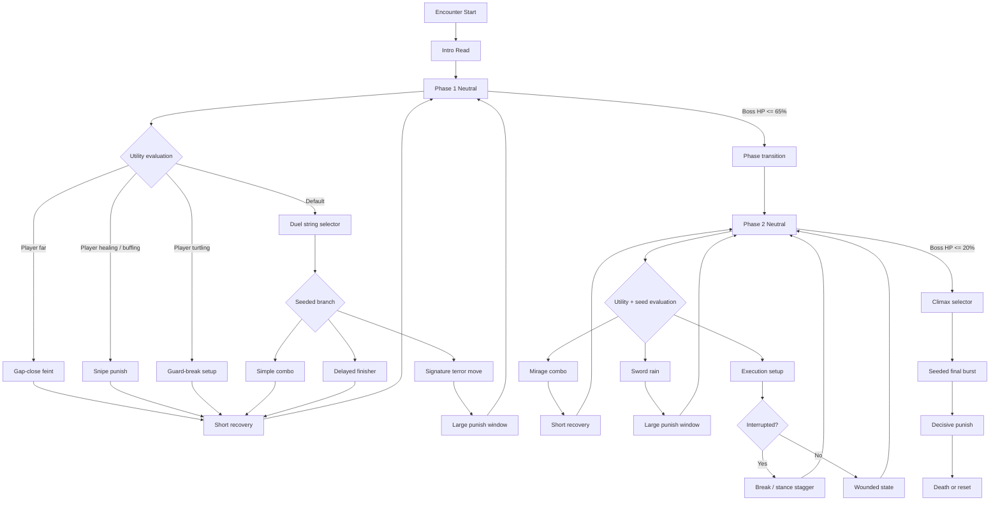

# Increasing the Appeal of Simon Through Elden-Ring-Style Boss Patterns and Algorithms

## Executive Summary

This report treats entity["fictional_character","Simon","expedition 33 boss"] as the target boss. Public sources identify Simon as *Clair Obscur: Expedition 33*’s infamous optional superboss, later expanded by rematch support and the harder “Divergent Star” variant, while the game’s combat direction openly draws on parry-centric action design associated with entity["video_game","Sekiro: Shadows Die Twice","2019 action game"]. Accordingly, the most rigorous interpretation of your request is to analyze Simon’s shipped encounter as the current baseline, then redesign it for an Elden-Ring-style boss experience rather than assume a separately documented official implementation inside *Elden Ring*. citeturn7view0turn4view0turn23view0turn33view1

The core finding is that Simon already has three strong ingredients for a memorable Soulslike boss: recognizable multi-hit strings, high audiovisual spectacle, and a genuine mastery ceiling. His appeal is reduced, however, by fatigue-heavy combo density, several agency-denial mechanics layered into the same encounter, and a learning loop that can slide from “hard but readable” into “rhythm-test attrition,” especially in post-update versions. The highest-value improvement is **not** simply reducing difficulty. It is making Simon **more duel-like, more interruptible, more clearly telegraphed, and more variable at the macro level while less exhausting at the micro level**. In practice, that means shorter but sharper terror moves, animation-truth hitboxes, guaranteed punish windows, layered visual/audio cues, seeded remix branching, and light, transparent adaptive systems outside top-difficulty challenge modes. citeturn19view2turn31view0turn33view0turn16view1turn18view4

## Scope and Current Boss Profile

The source base for this report is intentionally hierarchical. Where official materials exist, I prioritize them; where official materials are thin on boss behavior, I use public boss guides, challenge-run coverage, and design literature. For Simon, official sources establish rematch support, Battle Retry, and the later content update that added extra late-game bosses. For Elden Ring, official notes on entity["fictional_character","Malenia, Blade of Miquella","elden ring boss"] mainly document maintenance and fairness-sensitive bug fixes rather than per-move combat detail, so readable move analysis necessarily comes from gameplay guides and mastery-focused community material. citeturn20search0turn25view0turn20search3turn26view0turn7view0turn23view0turn31view1

**Behavior and move set.** Simon is an optional boss in The Abyss with no listed weakness, resistance, immunity, absorb, or weak point. Public guides enumerate **Chroma Shift**, **Shield Steal**, **Melee Combo**, **Short Combo**, **Long Combo**, **Powerful Combo**, **Lightspeed Combo**, and **Sword of Lumiere**. Chroma Shift reduces a target to 1 HP and cannot be dodged or parried; Shield Steal removes team shields and converts them into Simon’s advantage. Head-on play is additionally stressed by his ability to remove a fallen ally from the battlefield so that ally cannot be revived. citeturn8view2turn9view0turn19view2

**Phases.** In the normal encounter, phase 1 is a sword-and-special-mechanic duel. Phase 2 keeps most of the phase-1 sword strings but adds phantom follow-ups after each slash; when Simon reaches critical health, the number of follow-ups can rise again, effectively tripling required defensive inputs on some strings. Public reporting on the baseline fight also describes a later phase at roughly 30% HP where Simon forces the main party off the field and reserve members must finish the fight. Since patch 1.3.0, a rematch starts directly in phase 2. citeturn8view2turn9view1turn9view4turn7view4turn4view0

**Telegraphs.** Simon does have a readable grammar, but it is memory-heavy. Guides teach players to watch for sword plants, arm movement, jump flares, and light pillars. The later **Divergent Star** variant goes further: colored pillars of light behind Simon reveal both the number and order of follow-up hits, with white for the sword strike and colored pillars for additional echoes. On top of that, entity["organization","Sandfall Interactive","game studio"] later explained that parry timing was deliberately reinforced through attack audio, first with a “sweep” cue and then with a more consistent “Glissant Rush” reference hit embedded inside the attack sound itself. citeturn23view0turn33view0

**Hitboxes, damage types, and pacing.** In the public materials reviewed, exact frame data, collision volumes, target-selection weights, tracking coefficients, and per-move elemental attack types are **unspecified**. Public guides expose move names and approximate dodge/parry rhythms, but not action-RPG-grade hitbox geometry. What *is* clear is pacing: Simon is a burst-pattern boss. Base strings run from roughly 3 to 9 required defensive inputs; phase-2 versions can double or triple those requirements; and post-update player reactions complain about even longer combo density and multiple enemy turns before the player acts. The July 30, 2025 Battle Retry patch strongly suggests that rapid fail-and-retry learning is a central part of how the fight is expected to be consumed. citeturn9view0turn9view4turn31view0turn25view0

As an Elden Ring benchmark, Malenia shows a different balance of brutality and readability. Public guides document a move language built around quick slashes, lunges, a grab, Waterfowl Dance, a scripted phase-two Scarlet Aeonia opener, and rot-inflicting follow-ups, all with fairly concrete telegraphs and dodge directions. Official Bandai Namco notes also record a specific fix for her healing behavior in multiplayer, underscoring how strongly fairness perceptions hinge on whether life-steal and contact rules behave exactly as players expect. citeturn28view0turn29view0turn29view1turn26view0

## Player Experience Diagnosis

Simon creates a classic optional-superboss spike, which is valuable. He arrives late enough to operate as a mastery exam, and the community has demonstrated multiple legitimate ways to solve him: no-hit parry showcases, “all-hit” clears that avoid dodging and parrying entirely, rematches, and build-optimized one-turn kills. That breadth implies that Simon’s combat shell is not shallow. The problem is that the fight often tests **buildcraft, rhythmic defense, team construction, and attrition tolerance at the same time**, so the first-contact difficulty curve can feel steeper and less legible than the strongest Elden Ring duels, where challenge usually concentrates more clearly into spacing, punish recognition, and stamina discipline. citeturn7view2turn31view1turn30search0turn30search4turn28view0turn29view1

Learning opportunities are present, but they are unevenly distributed. On the positive side, Simon’s attacks are named, patterned, and stable enough for guides to teach hit-by-hit solutions. On the negative side, too many high-punishment mechanics are compressed into one encounter: HP-to-1 reduction, shield theft, ally removal, forced reserve usage, and, in harder variants, first-turn pressure plus removal effects that invalidate common defensive assumptions. Public reporting also suggests that the developers wanted boss mechanics to remain technically solvable without mandatory unavoidable damage. My inference is that Simon is **fair in the narrow technical sense**—learnable, beatable, and mastery-compatible—but only **conditionally fair in the experiential sense**, because one misread can erase too much state and too much time. citeturn8view2turn19view2turn23view0turn32news39

Spectacle is one of Simon’s clearest wins. Giant swords, luminous arena cues, phase shifts, and music-synced defensive timing give the encounter a distinctive identity. That matters, because the best Soulslike bosses are not only difficult systems; they are dramatic performances. Replayability is also meaningfully above average thanks to Simon rematches, challenge modifiers, Battle Retry, and the later Divergent Star extension. The weakness is that the replay value is currently polarized. Experts receive a rich challenge-run sandbox, but average players are strongly incentivized either to route around the intended fight with one-shot builds or to stop engaging once combo density crosses from thrilling to tedious. citeturn9view4turn33view0turn16view0turn20search0turn25view0turn23view0turn31view0turn7view2

## Soulslike Design Patterns and AI Technique Survey

A strong Soulslike boss usually combines a **readable move language**, a **punish rhythm that rewards nerve instead of pure rote memory**, and a **phase escalation that changes verbs rather than merely adding bigger numbers**. Malenia remains a useful benchmark: she is vicious, but guides can still point to concrete reads such as arm flashes, hop timing, roll directions, and a scripted phase-two opener. More broadly, commentary on Dark Souls-style design consistently argues that “tough but fair” does not mean constant escalation or rule-breaking; it means that perceived difficulty should shrink as mastery grows. That principle aligns with entity["people","Hidetaka Miyazaki","fromsoftware director"]’s stated preference for bosses that contain “contradiction” rather than raw fear alone. Simon should therefore borrow not Malenia’s cruelty by itself, but her mix of terror, legibility, and recoverable trust. citeturn28view0turn29view0turn29view1turn16view0turn16view1turn26view0

For the underlying AI and pattern architecture, the best fit is a **hybrid** rather than a single technique:

- **Finite-state machines** are ideal for high-level phase management, transition gates, signature move cooldowns, and guaranteed punish states. They are simple, reusable, easy to maintain, and excellent for bosses with a small number of strongly differentiated combat modes. Their weakness is combinatorial growth: once too many conditional exceptions accumulate, extension and reuse become painful. citeturn18view8turn39view0

- **Behavior trees** are better for modular attack selection inside each phase. They centralize transition logic, improve reuse, and scale more cleanly than FSM-only architectures. Modern event-driven or second-generation BTs also support deeper trees, better memory behavior, and clearer designer-facing logic, which is especially useful if Simon is meant to support remixes, rematches, and alternate challenge presets. citeturn18view5turn40view3turn39view0

- **Utility AI** is the strongest option for contextual attack choice. Utility architectures score options rather than hard-branching them, which means Simon can decide whether a gap-close, anti-heal punish, spacing reset, terror move, or execution setup is *most appropriate right now*. Weighted or rank-plus-weight selection also lowers repetition because the boss does not always choose the single top-scoring move in exactly the same way. That is especially attractive for a duelist boss whose threat should feel intelligent without becoming unreadable. citeturn40view0turn40view2

- **Procedural variation and seeded randomness** should be used lightly and at the **macro-pattern** level, not the per-hit level. entity["video_game","Left 4 Dead","2008 video game"]’s design framing around “structured unpredictability” is directly relevant: low-probability, high-drama events are memorable, but only if anticipation and pacing remain intelligible. PCG literature reaches a similar conclusion from the technical side: seeded PRNGs preserve variety while keeping encounters reproducible for debugging, player learning, and challenge play. For Simon, that means seeded opener families, finisher branches, or phase-two remixes—not hidden micro-random timing drift inside already-demanding strings. citeturn18view4turn17view0turn37view0

- **Adaptive difficulty** is useful only when it is subtle, genre-bound, and transparent. Dynamic-difficulty research emphasizes that metrics should reflect the specific genre and be captured in real time. For Simon, the safest adaptive targets are combo-extension probability, parry grace on lower difficulties, or how often the boss chooses a long-string branch after repeated failures. The least safe targets are silent hitbox changes, unexplained tracking shifts, or invisible damage rewrites that undermine trust. citeturn16view3turn17view2turn18view0turn18view2turn18view3

## Prioritized Redesign Recommendations

Because implementation constraints for an Elden Ring version were not specified, I assume full access to scripting, animation, camera, VFX, and combat tuning. The only concrete public production constraint visible from Expedition 33 is that the team favored modular, designer-driven authoring through Unreal Blueprints and reusable gameplay elements, which argues for data-authored behaviors rather than bespoke hardcoded attack exceptions. citeturn34view0turn34view1

1. **Reframe Simon as a duel first and a rhythm exam second.**  
   Reduce the average number of defensive inputs per enemy turn and reserve multi-echo extensions for a few carefully chosen signature finishers rather than attaching follow-ups to nearly everything. This directly addresses the strongest current complaint about post-update Simon: the fight becomes exhausting before it becomes expressive. Implementation-wise, use a high-level FSM for phase gates and a BT or utility layer that enforces a “one high-complexity branch per cycle” budget. citeturn31view0turn40view0turn40view3

2. **Convert non-interactive punishers into interactive punishers.**  
   Chroma Shift should not simply bottom a player out to 1 HP with no answer in an Elden-Ring-style adaptation. A stronger version is a visible “execution mark” that expires unless the player rolls, line-of-sights, or interrupts the follow-up. Likewise, shield theft should become a punish for over-turtling, not a flat denial mechanic, and ally-removal logic should be replaced by interruptible execution states instead of silent deletion. Player impact: much higher agency without removing threat. citeturn8view2turn19view2turn23view0

3. **Adopt a consistent telegraph stack across all phases.**  
   Every major attack should expose the same four layers: body pose, directional VFX, timing audio, and impact-space cue. Simon already has the raw pieces—sword-plant silhouettes, light pillars, and audio-assisted parry timing—so the redesign should formalize them rather than invent a new language. I would specifically reuse the Divergent Star color-coded pillar concept for phase-two echoes and combine it with the “Glissant Rush” timing cue so players can read attacks through sight or sound. citeturn23view0turn33view0

4. **Tune hitboxes and tracking to animation truth.**  
   If Simon’s blade visually missed, the player should not take damage. If a giant sword AoE lands on a pillar marker, the footprint should match that marker exactly. If a lunge commits forward, late-course correction should be tightly capped. This is less about generosity than about trust: Elden Ring’s best duels feel hard because the player believes the rules are stable. Implementation note: add post-swing overlay review, “edge kiss” logging, and per-attack tracking budgets in QA. citeturn26view0turn28view0turn29view1

5. **Guarantee punish windows after signature terror moves and phase transitions.**  
   Simon’s biggest attacks should create obvious moments of emotional release. After a Lightspeed-style burst, sword-rain climax, or whiffed execution setup, give the player a short but meaningful punish window or a stance-break opportunity. This is one of the cleanest ways to make a punishing boss feel *fun* instead of merely oppressive. The recommendation is grounded in the fact that the current fight has abundant threat but relatively little decompression once the defensive gauntlet starts. citeturn9view4turn31view0

6. **Use seeded macro-variation, not hidden micro-chaos.**  
   Simon should have 4–6 opener seeds, 3–4 midfight branch families, and 2–3 low-HP climaxes. Those should be deterministic within a pull and loggable for debugging and replay analysis. The result is higher replayability and less guide fossilization without sacrificing readability. Implementation note: seed at encounter start, then let the utility layer score within the active branch family rather than fully randomizing all branches every cycle. citeturn18view4turn17view0turn37view0

7. **Keep adaptive systems light, transparent, and mostly below top challenge modes.**  
   Default and accessibility-oriented modes can safely widen parry grace or reduce long-string extension probability after repeated wipes. Hard, expert, and special rematch modes should stay fixed unless the player explicitly opts into assistance. This preserves trust while still helping more players reach the “I see it now” moment. Expedition 33 has already shown a willingness to expose difficulty-support options directly through Story Mode tuning and Battle Retry, so this direction is compatible with the game’s own post-launch philosophy. citeturn20search0turn25view0turn16view3turn18view0

8. **Separate progression-clear Simon from challenge-run Simon.**  
   The current ecosystem already has rematches, challenge modifiers, and harder late-game variants. Lean into that. The first clear should emphasize the strongest, most legible version of Simon’s duel identity; the expert rematch should then layer in the nastier branches, extra echoes, and tighter punish expectations. This preserves spectacle and prestige while broadening appeal. citeturn20search0turn23view0turn31view0

The following pattern sets are the most viable alternatives for an Elden-Ring-style Simon redesign.

| Pattern name | Algorithm type | Player experience | Implementation complexity | Expected fun/difficulty |
|---|---|---|---|---|
| Duelist Core | Hierarchical FSM | Clean reads, short punishes, strong trust, broad appeal | Low–Medium | High fun / Medium–High difficulty |
| Mirage Echo | BT with seeded branches | Spectacle-heavy but still legible; surprise without chaos | Medium | High fun / High difficulty |
| Execution Dance | Utility AI | Feels “smart”; punishes healing, turtling, and panic rolls contextually | Medium–High | High fun / High but fair difficulty |
| Adaptive Crescendo | BT + light DDA | Strong onboarding, smoother repeated attempts, lower frustration | High | Broad fun / Variable difficulty |
| Seeded Challenge Rematch | Seeded procedural variation + fixed difficulty | Best for replay and challenge communities; least onboarding-friendly | Medium | Niche but excellent fun / Very high difficulty |

These designs can be expressed cleanly as a state-driven shell with utility-scored branches. The diagram below prioritizes readability, punish cycling, and a clearer climax structure than the current burst-heavy baseline. The timing chart is expressed in **design beats**, not literal frame data, because exact public frame counts for Simon are unspecified in the source base reviewed here. citeturn9view4turn23view0turn40view0turn40view3

```mermaid
gantt
    title Proposed phase pacing in design beats
    dateFormat  X
    axisFormat %L

    section Opening
    Readable opener             :a1, 0, 18
    Signature check             :a2, 18, 8
    Punish window               :a3, 26, 4
    Reset and spacing           :a4, 30, 6

    section Midfight
    Phase transition            :b1, 36, 10
    Mirage pressure loop        :b2, 46, 24
    Signature check             :b3, 70, 8
    Extended punish             :b4, 78, 5

    section Climax
    Low-HP mixup                :c1, 83, 14
    Final terror burst          :c2, 97, 8
    Decisive punish or kill     :c3, 105, 5
```





## Evaluation Framework

The evaluation goal should be **not** “make Simon easier,” but “make Simon more learnable, fair-feeling, and replayable without collapsing his prestige.” I would instrument the encounter at three levels. First, **behavioral metrics**: attempts to first clear, time to first phase transition, average damage taken per boss turn, parry success by move family, percentage of deaths caused by non-interactive punishers, average punish-window damage realized, and rematch uptake. Second, **experience metrics**: post-fight ratings for fairness, telegraph clarity, spectacle, frustration, and desire to rematch. Third, **style-expression metrics**: rate of clears by archetype, including standard duel clears, challenge-route clears, heavy-build clears, and anti-cheese clears. These are all genre-bound, real-time-capturable metrics, which is exactly what adaptive-systems literature recommends. citeturn18view0turn18view2turn18view3

Methodologically, I would run four passes. A **blind first-contact test** measures how many rules players can infer without explanation. A **mastery test** runs the same players through repeated attempts with Battle Retry enabled to measure whether understanding accumulates cleanly. An **A/B test** compares the current Simon-inspired baseline against the redesign variants, focusing on contested deaths and telegraph confidence. Finally, an **expert challenge panel** uses fixed seeds and anti-cheese constraints to verify that the skill ceiling remains high and that seeded variation is still legible under pressure. Every disputed death should be reviewed with slow-motion captures, hitbox overlays, event logs, and seed replay. Battle Retry is especially important here because it compresses the learning loop and makes quantitative comparison cleaner. citeturn25view0turn18view4turn37view0

I would treat the redesign as successful if it produces a **modest** reduction in median attempts-to-clear, a **material** increase in fairness and telegraph-clarity scores, a **higher** desire-to-rematch score, and **no meaningful loss** of challenge-run viability. The ideal outcome is a boss that still supports no-hit showcase play and high-skill bragging rights, but makes a much larger share of players say, “that was brutal, but I understood why I died, and I want another pull.”

## Source URLs

```text
https://www.expedition33.com/post/patch-1-3-0-is-now-live
https://www.expedition33.com/post/patch-1-4-0-is-now-live
https://www.expedition33.com/post/thank-you-update-available-now-thank-you-for-an-amazing-year
https://game8.co/games/Clair-Obscur-Expedition-33/archives/518399
https://game8.co/games/Clair-Obscur-Expedition-33/archives/570981
https://www.gamesradar.com/games/rpg/clair-obscur-expedition-33-director-praises-the-rpg-sicko-who-managed-to-beat-the-most-infamous-boss-by-taking-every-hit-without-cheesing-i-tried-to-do-it-before-release-and-i-couldnt-manage-it/
https://www.gamesradar.com/games/rpg/clair-obscur-expedition-33-players-face-a-gommage-of-their-own-as-the-french-jrpgs-update-makes-its-hardest-bosses-even-nastier-i-had-to-figure-out-how-to-parry-attacks-on-the-hardware-level/
https://www.gamesradar.com/games/rpg/parrying-was-not-easy-clair-obscur-expedition-33-devs-had-to-turn-to-sound-to-fix-an-integral-part-of-the-jrpgs-combat/
https://www.gamesradar.com/games/rpg/clair-obscur-expedition-33-creative-director-put-parrying-in-his-turn-based-rpg-after-playing-sekiro-and-thinking-why-cant-i-parry-in-my-game/
https://blog.playstation.com/2026/03/11/how-the-clair-obscur-expedition-33-dev-process-powered-creative-design-freedom/
https://en.bandainamcoent.eu/elden-ring/news/elden-ring-update-notes-104
https://www.bandainamcoent.com/news/elden-ring-patch-notes-v1-04-1
https://game8.co/games/Elden-Ring/archives/371333
https://www.gamedeveloper.com/design/-i-dark-souls-i-director-miyazaki-offers-his-philosophy-on-boss-design
https://www.gamedeveloper.com/design/the-design-lessons-designers-fail-to-learn-from-dark-souls
https://www.gameaipro.com/GameAIPro3/GameAIPro3_Chapter12_A_Reusable_Light-Weight_Finite-State_Machine.pdf
https://www.gameaipro.com/GameAIPro/GameAIPro_Chapter06_The_Behavior_Tree_Starter_Kit.pdf
https://course.ccs.neu.edu/cs5150f13/readings/dill_designpatterns.pdf
https://media.gdcvault.com/gdc10/slides/MarkDill_ImprovingAIUtilityTheory.pdf
https://users.cs.northwestern.edu/~hunicke/pubs/Hamlet.pdf
https://cdn.fastly.steamstatic.com/apps/valve/2009/GDC2009_ReplayableCooperativeGameDesign_Left4Dead.pdf
https://course.khoury.northeastern.edu/cs5150f13/readings/hendrikx_pcgg.pdf
https://www.sciencedirect.com/science/article/pii/S0921889022000513
https://www.scss.tcd.ie/publications/theses/diss/2011/TCD-SCSS-DISSERTATION-2011-056.pdf
```