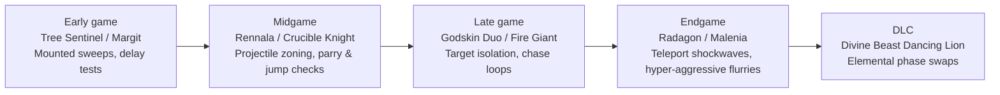
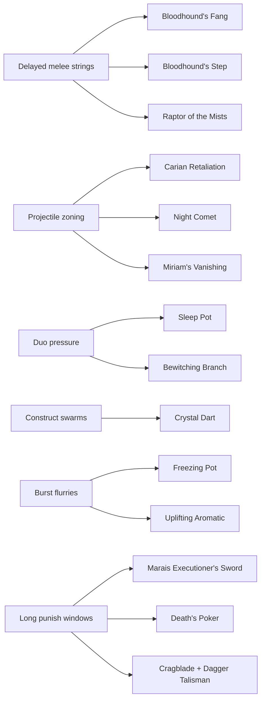

# Elden Ring Systems That Make Combat More Enjoyable

## Executive summary

The most enjoyable combat in Elden Ring does **not** usually come from the highest raw DPS options. It comes from tools that either widen the player’s choices mid-fight or turn a boss script into a readable, interactive puzzle. In practice, the strongest “fun enhancers” fall into three groups: **pattern converters** such as Freezing Pot, Sleep Pot, Carian Retaliation, Night Comet, and Crystal Dart; **mobility and counter-expression tools** such as Bloodhound’s Fang, Bloodhound’s Step, and Raptor of the Mists; and **commitment-reward tools** such as Marais Executioner’s Sword, Death’s Poker, Cragblade, and crit talismans that make difficult timing windows feel worth taking. These items increase agency, produce emergent interactions, support more build identities, and create stronger audiovisual payoff when the player reads the encounter correctly. citeturn17search25turn18search0turn14search15turn16search0turn13search2turn11search21turn14search4turn14search0turn25search4turn25search5turn14search3turn21search3

On the current official balance line, the encounter-shaping patches that matter most for “fun” are older than the latest bug-fix versions: patch 1.06 sped up heavier weapon classes and nerfed Bloodhound’s Step; patch 1.12.3 extended Smithscript throw range and fixed a set of DLC issues; patch 1.14 explicitly adjusted the DLC final boss’s opening pattern, attack visibility, damage, stamina damage, and some ranges; and patches 1.16/1.16.1 were mostly bug-fix releases rather than major PvE redesigns. That means the modern game is best understood as a post-1.06, post-DLC, readability-focused ruleset rather than its launch state. citeturn10view0turn10view2turn10view3turn26search3turn22view0

## Method and criteria

This report uses the following source priority: official patch notes from entity["organization","FromSoftware","japanese game studio"] and entity["company","Bandai Namco Entertainment","game publisher"] where available; then major English Elden Ring wikis for item descriptions and move data; then higher-quality guides from outlets such as GameSpot, PC Gamer, GamesRadar, and specialist tutorial videos when they clearly identified a counter or attack tell. The scope includes both the base game and the DLC entity["video_game","Shadow of the Erdtree","elden ring dlc"]. citeturn10view0turn10view2turn10view3turn22view0turn24search10turn18news35turn3search1turn4search0turn4search1

For this report, **fun** means four things. **Agency** means the item lets the player answer the same attack pattern in multiple ways. **Emergent interaction** means the item changes enemy behavior, arena control, or target priority rather than only adding damage. **Build diversity** means the item opens a distinct playstyle or stat identity. **Satisfying feedback** means the game clearly rewards good reads with stance breaks, visible interrupts, dramatic follow-ups, or strong rhythm. Descriptions below are paraphrases of in-game text as transcribed by the major wikis; the purpose here is analysis, not verbatim reproduction. citeturn11search21turn24search0turn25search0turn25search5turn12search11turn17search17

A useful official clue is that later patches repeatedly improve **readability** and **versatility**. Patch 1.06 sped up strong attacks, charge attacks, and guard counters on larger classes, and patch 1.14 explicitly says it improved the visibility of some DLC final-boss effects. In other words, the official tuning history supports the same conclusion players report informally: combat gets more enjoyable when the game makes more patterns legible and gives more classes meaningful answers. citeturn10view0turn10view3turn26search0

## Catalog of items that enhance fun

The table below is a compact comparison matrix. These ratings are this report’s synthesis rather than a direct game statistic.

| Item | Agency | Emergent interactions | Build diversity | Feedback | Complexity | Accessibility |
|---|---|---:|---:|---:|---|---|
| Bloodhound’s Fang | High | Medium | Medium | Very high | Medium | High |
| Sword of Night and Flame | High | Medium | Very high | High | Medium | Medium |
| Marais Executioner’s Sword | Medium | Medium | Medium | Very high | High | Medium |
| Death’s Poker | High | High | Medium | Very high | Medium | Medium |
| Smithscript Cirque | High | Medium | High | High | Medium | Low |
| Shard of Alexander | Medium | Low | High | Medium | Low | Medium |
| Godfrey Icon | Medium | Low | High | Medium | Low | Medium |
| Blue Dancer Charm | High | Low | Medium | Medium | Medium | High |
| Freezing Pot | High | High | High | High | Low | Medium |
| Sleep Pot | Medium | High | Medium | Medium | Low | Medium |
| Crystal Dart | Medium | Very high | Low | Medium | Low | High |
| Carian Retaliation | High | High | Medium | High | High | Medium |
| Raptor of the Mists | High | Medium | Medium | High | High | Medium |
| Cragblade | Medium | Low | Medium | High | Low | Medium |
| Night Comet | Medium | Medium | High | Medium | Low | Medium |

**Weapons**

| Item | In-game description and mechanics | Why it increases enjoyment | Ideal use cases | Trade-offs |
|---|---|---|---|---|
| Bloodhound’s Fang | A curved greatsword associated with the Bloodhound Knights and framed as a weapon for brutal airborne attacks. Its unique skill, Bloodhound’s Finesse, launches an upward slash into a retreating somersault; the heavy-input follow-up becomes a Bloodhound’s Step attack. Patch 1.06 also fixed a bug that made its two-handed jump attack break stance less reliably than intended. citeturn11search21turn11search17turn10view0 | It turns spacing into a *choice* rather than a retreat. The skill can disengage, bait, and re-enter, so even familiar melee bosses feel like a dance rather than a stat check. | Humanoid duel bosses, delayed melee encounters, players learning jump-punish rhythm. | Unique skill means less customization; easy to become repetitive if reduced to jump attacks only. |
| Sword of Night and Flame | A legendary Carian straight sword with Night-and-Flame Stance. The light follow-up is a magic beam that scales meaningfully with Intelligence and is best for single targets; the heavy follow-up is a close fire sweep that scales with Faith and handles crowds well. citeturn24search0turn24search1turn24search10 | Few weapons offer a cleaner “choose the right mode for the pattern” loop. It rewards reading whether the fight wants range, burst, or close horizontal control. | Mixed enemy packs, bosses with safe mid-range punishes, hybrid Int/Faith runs. | High stat and FP demands; fun falls off sharply if used only as beam spam. |
| Marais Executioner’s Sword | A legendary House Marais greatsword whose Eochaid’s Dancing Blade telekinetically throws the blade forward into a violent corkscrew. The skill can be charged to increase reach and spinning duration, and it scales especially well with total attack rating buffs. citeturn25search0turn25search4turn25search2turn25search25 | This is one of the cleanest “I earned this window” weapons in the game. Long recoveries become invitations for a huge multihit drill, which makes patient play feel spectacular. | Large hurtboxes, clear punish windows, stance-break wakeups, slow recovery bosses. | High commitment; highly mobile enemies can sidestep or make the spin whiff. |
| Death’s Poker | A Deathbird rod whose Ghostflame Ignition creates a ghostflame point and then branches into three routes: detonation if left alone, a lingering flame trail on light follow-up, or a large explosion on heavy follow-up. The weapon art scales extremely well with Intelligence and the weapon innately builds Frost. citeturn25search5turn25search1turn25search14turn25search9 | It combines zoning, burst, spacing traps, and frost management in one weapon. That gives the player route-planning decisions that few melee weapons create. | Large bosses, chokepoints, bosses that re-enter fixed space after dodging, players who enjoy area denial. | Terrain and slope can interfere; setup time is risky against constant rushdown. |
| Smithscript Cirque | A DLC backhand blade engraved with smithscript. Its strong attack throws the blade in a curved trajectory, and patch 1.12.3 officially extended its throwing range. citeturn23search2turn23search0turn10view2 | It adds a short-ranged “pseudo-ranged” layer to dexterity play, letting the same weapon alternate between sidestep pressure and curved projectile control. | Mobile bosses, skirmish play, players who like weaving melee with throw pressure. | DLC-gated, and even post-buff it does not replace true ranged tools. |

The weapon standouts are mechanically expressive in very different ways: one is a spacing-and-reentry blade, one is a stance-based mode switcher, one is a punish-window drill, one is a zone-creating trap weapon, and one is a melee-throw hybrid. That diversity is precisely why they keep encounters fresh across repeated playthroughs. citeturn11search21turn24search1turn25search4turn25search5turn23search2

image_group{"layout":"carousel","aspect_ratio":"16:9","query":["Elden Ring Bloodhound's Fang gameplay", "Elden Ring Sword of Night and Flame gameplay", "Elden Ring Marais Executioner's Sword gameplay", "Elden Ring Death's Poker gameplay"], "num_per_query": 1}

**Talismans**

| Item | In-game description and mechanics | Why it increases enjoyment | Ideal use cases | Trade-offs |
|---|---|---|---|---|
| Shard of Alexander | Greatly boosts skill attack power by 15%. citeturn12search0turn12search6turn12search16 | It raises the payoff for expressive weapon arts, encouraging players to use a weapon’s “personality move” rather than ignore it. | Bloodhound’s Fang, Marais Executioner’s Sword, Death’s Poker, Sword of Night and Flame. | Gives little to plain light/heavy-attack builds. |
| Godfrey Icon | Raises charged sorceries, incantations, and skills by 15%. citeturn12search1turn12search11turn12search21 | It makes boss readability matter more, because the player is rewarded for waiting for the *real* charge window rather than panic-casting. | Charged Night Comet, charged Eochaid’s Dancing Blade, charged spellblade setups. | Dead weight if your kit is mostly unchargeable. |
| Old Lord’s Talisman | Extends spell duration by about 30%, including many sustained buffs and regeneration effects. citeturn12search2turn21search13turn21search30 | Long-duration buffs reduce maintenance friction and let the player focus on the combat script rather than reapplying every half-minute. | Hybrid caster builds, pre-buff routes, repeated attempt consistency. | Helps maintenance and planning more than immediate burst. |
| Blue Dancer Charm | Gives a physical-damage bonus based on **current carried equip load**, peaking at about 15% at very low load and dropping to zero at 30+ load. citeturn21search1turn21search22turn12search10 | It makes armor, offhand, and weight budgeting part of the build’s identity. That changes how the player *moves*, not just how hard they hit. | Light-load duelists, sidestep-heavy or jump-heavy melee play. | Demands fragility and careful gear planning. |
| Dagger Talisman | Increases critical damage by 17%. citeturn21search0turn21search3turn21search14 | It turns stance breaks, parries, and guard counters into satisfying goals in themselves, giving posture play a strong finishing reward. | Cragblade setups, guard-counter play, Misericorde sidearms, parry routes. | Low value if the player rarely creates critical windows. |

**Consumables**

| Item | In-game description and mechanics | Why it increases enjoyment | Ideal use cases | Trade-offs |
|---|---|---|---|---|
| Freezing Pot | A craftable ritual pot that causes substantial frost buildup; the major wiki data lists 380 frost buildup, enough to force dramatic interrupts on some targets. It is a well-known answer to Malenia’s Waterfowl Dance when the frost proc lands during the aerial start-up. citeturn17search25turn13search29turn18news35 | It is a near-perfect “emergency answer” item: low execution cost, huge pattern impact, and a clear sense that preparation matters. | Malenia, any frostable boss, panic insurance for difficult burst phases. | Requires crafting and loses consistency as frost resistance grows. |
| Sleep Pot | A cracked-pot consumable that inflicts sleep buildup. Guides consistently recommend it against the Godskin Duo because sleep lets the player isolate one target at a time. citeturn17search17turn17search5turn18search0turn18search8turn18search19 | It changes multi-target fights from chaos into target-priority puzzles, which is one of the cleanest forms of encounter agency in the game. | Godskin Duo, sleep-vulnerable humanoids, crowd control. | Many enemies resist or ignore sleep, and sleeping targets wake on hit. |
| Uplifting Aromatic | A perfume that raises the user’s and nearby allies’ attack power and reduces one incoming hit by half. citeturn13search26turn13search4 | It creates exciting “I can steal one mistake” windows, especially in co-op or before phase transitions. | Co-op leadership, opener buffs, unstable boss phases. | Costs materials and occupies an aura-buff niche. |
| Ironjar Aromatic | Temporarily turns the body to steel, increasing poise, resistances, and damage negation while reducing mobility and increasing vulnerability to lightning. citeturn13search16turn13search8 | It briefly transforms the rules of the fight: instead of avoiding every hit, the player can deliberately build a trade-heavy window. That creates a totally different emotional texture. | Slow bosses, hyperarmor trades, deliberate punish routes. | No sprint and poor mobility can be fatal; lightning becomes dangerous. |
| Crystal Dart | A magic throwing dart that can drive construct enemies such as imps, Burial Watchdogs, and golems into a frenzy state after enough hits, causing them to attack other targets. citeturn13search2turn13search5turn13search13 | This is one of Elden Ring’s best emergent tools because it rewrites the room’s allegiance structure instead of merely adding damage. | Imp swarms, watchdog rooms, construct-heavy dungeons. | Extremely target-specific. |
| Bewitching Branch | A branch blessed with unalloyed-gold magic that pierces a foe and makes it a temporary ally. citeturn17search0turn17search22 | It is pure encounter re-authorship: the player temporarily turns an enemy piece into their own piece. That is unusually playful for a Souls game. | Humanoid crowds, dense mob packs, role-reversal setups. | Short range, FP cost, and narrow boss utility. |

**Ashes of War**

| Item | In-game description and mechanics | Why it increases enjoyment | Ideal use cases | Trade-offs |
|---|---|---|---|---|
| Bloodhound’s Step | A fast evasive skill that makes the player briefly hard to track while dodging, with greater travel than regular Quickstep. Official patch 1.06 reduced its invincibility and travel distance and weakened repeated-use performance. citeturn14search8turn14search4turn10view0 | It is still fun because it enables highly expressive movement without being as untouchable as its launch state. | Learning difficult boss choreography, dodge-heavy skirmishing, repositioning in mixed packs. | Easy to overuse; can flatten learning if it replaces timing rather than supports it. |
| Carian Retaliation | A shield ash that dispels incoming sorceries and incantations into retaliatory glintblades, and it also works as a normal parry. citeturn14search15turn14search5 | Few mechanics feel better than reversing a caster’s pressure into your own offense. It converts defense into spectacle. | Spell-heavy fights, mage enemies, rune-bearers who use magic volleys. | High timing burden and not relevant in every encounter. |
| Raptor of the Mists | The user dips into a low stance and vanishes for a moment; if an attack connects, the skill launches the user upward. citeturn14search0turn14search2turn14search19 | It rewards knowing *when* the hitbox will land, then transforms that knowledge into a jump-punish opportunity. | Predictable slams, jump-attack builds, stylish single-hit punish routes. | Reactive rather than universal; awkward against lingering or multi-stage AoEs. |
| Cragblade | Reinforces a weapon with stone, increasing attack power and making enemy stance breaks easier. Community mechanical pages also note that post-launch balance changed its duration and poise effects over time, but the current gist is constant: it is a posture-pressure buff. citeturn14search3turn14search11turn14search20 | It turns combat into a visible posture game. Players feel a strong “setup -> pressure -> break -> crit” rhythm. | Straight swords, fists, hammers, guard-counter play, bosses vulnerable to stance damage. | Mostly fun if the player actively plays for stance breaks rather than generic DPS. |

**Spells**

| Item | In-game description and mechanics | Why it increases enjoyment | Ideal use cases | Trade-offs |
|---|---|---|---|---|
| Carian Slicer | A fast Carian sorcery that conjures a magic sword and can be used without delay after other actions. citeturn15search8turn15search18turn15search26 | It gives sorcery builds a real close-range rhythm, which prevents “wizard gameplay” from becoming only backpedal-and-cast. | Spellblades, aggressive caster play, fast enemies that deny long casts. | Requires staying close; can be parried if misused. |
| Night Comet | A semi-invisible night sorcery that can be cast repeatedly and while moving; major wiki and guide sources note that many PvE enemies do not react by dodging it. citeturn16search3turn16search0turn16search7turn16search15 | It is fun because it changes ranged combat from baiting enemy AI dodges to threading damage through pressure safely. | Dodging bosses, evasive humanoids, caster duels, sustained magic play. | Less efficient if the target never dodges in the first place; weaker versus pure magic resistance. |
| Rock Sling | Pulls rocks from the earth and throws them in an arc; key sources note that it deals physical damage and strong stance damage for a sorcery. citeturn15search0turn15search3 | It lets mages interact with posture and trajectory, not just raw HP. That is a major increase in agency. | Large targets, shielded foes, enemies standing behind cover, stagger setups. | Slower cast and travel time than simple glintstone projectiles. |
| Miriam’s Vanishing | A DLC sorcery that hides the caster in glintstone haze and repositions them according to directional input. citeturn15search29turn15search1turn15search17 | It gives the caster movement tech, angle resets, and mind-game value. That dramatically increases build expression even when the spell itself deals no damage. | Spellblade feints, reset after pressure, creating safer follow-up angles. | Takes practice and does not solve damage checks by itself. |

## Catalog of enemy and boss patterns

The most rewarding enemy scripts in Elden Ring are the ones that are **learnable but not trivial**. They usually advertise one thing, then slightly extend, delay, reposition, or phase-shift the consequence. The table below compares the most important shared patterns.

| Pattern | Typical tell and phase logic | Representative examples | Difficulty | Counterplay that stays enjoyable |
|---|---|---|---|---|
| Delayed melee strings and roll-catches | Boss holds the weapon longer than instinct suggests, then punishes early panic-rolling; some strings add daggers, tails, or late extensions. | entity["fictional_character","Margit, the Fell Omen","elden ring boss"] uses spectral dagger and hammer extensions and very long gap-closing attacks; entity["fictional_character","Crucible Knight","elden ring enemy"] has many parryable phase-one attacks and later adds new follow-ups. citeturn19search0turn19search4turn18search2turn9search18 | High | Delay your dodge later than instinct, punish once, and use re-entry tools rather than greedy strings. |
| Jump-check stomps and ground shockwaves | Clear foot plant or slam cue creates a ground wave that often rewards jumping more than rolling. | entity["fictional_character","Godfrey, First Elden Lord","elden ring boss"] has spike-generating stomps that are easier to jump than i-frame cleanly. citeturn9search1turn4search15 | Medium-high | Jump attacks, Raptor of the Mists, late grounded punish after the wave resolves. |
| Projectile zoning and anti-caster pressure | Staff, moon, or ranged magic startup creates layered homing or beam pressure that punishes panic movement. | entity["fictional_character","Rennala, Queen of the Full Moon","elden ring boss"] cycles multiple projectile families in phase two, including a moon, beams, and homing volleys. citeturn19search9turn19search6 | Medium | Strafe first, roll second; use Carian Retaliation, line-of-sight breaks, or Night Comet. |
| Hyper-aggressive aerial flurries | Sudden air rise or blur-dash announces a multi-hit burst with high positional demand. | entity["fictional_character","Malenia, Blade of Miquella","elden ring boss"] begins using Waterfowl Dance around 75% HP, heals on hits as intended after patch fixes, and in phase two adds scarlet rot area pressure. citeturn18search1turn10view1turn18news35 | Very high | Pre-space, interrupt with frost proc when possible, or use long-movement defensive tools. |
| Duo pressure and shared-resource encounters | Arena asks the player to manage two bodies, often with respawns, revives, or a shared health bar. | entity["fictional_character","Godskin Duo","elden ring boss duo"] shares one main HP bar, can revive, and is commonly managed by pillars plus sleep control. citeturn9search3turn18search8turn18search0 | High | Sleep to isolate, pillar-separate, burst one body, then reset spacing. |
| Large-body chase and reposition loops | Huge target rolls, gallops, or re-anchors the fight so the challenge becomes sticking to a safe limb or head zone. | entity["fictional_character","Fire Giant","elden ring boss"] rolls to create distance and in phase one attacks with dish slams and avalanche pressure. citeturn20search3turn20search24 | Medium-high | Fight for anchor position rather than raw DPS, and punish turn-radius downtime. |
| Teleport and arena-reset punishers | Boss vanishes or relocates centrally, then emits large shockwave strings that punish stamina mismanagement. | entity["fictional_character","Radagon of the Golden Order","elden ring boss"] teleports to center below half HP and performs repeated expanding hammer shockwaves. citeturn19search5turn19search1 | High | Save stamina, roll late and inward, punish after the final slam rather than the first. |
| Elemental mode shifts | Boss keeps its basic body language but overlays new elemental attacks, so the player must re-interpret spacing rules on the fly. | entity["fictional_character","Divine Beast Dancing Lion","elden ring dlc boss"] changes elemental phases mid-fight, retaining much of the base moveset but adding phase-specific pressure. citeturn20search2turn20search18 | High | Read the *mode* first, then decide whether to stay close, disengage, or use a consumable reset. |

The progression below captures how the game escalates encounter literacy from simple mounted or delayed swings to multi-target control, hyperaggression, and elemental mode swaps. citeturn19search4turn9search1turn18search8turn19search5turn18search1turn20search18

## Interaction analysis

The most engaging encounters happen when an item does **not** erase the boss pattern, but instead reframes it into a new mini-game. Freezing Pot does this by turning Malenia’s most infamous burst sequence into a craft-and-react test. Sleep Pot does it by converting a duo fight into target isolation. Carian Retaliation does it by flipping spell pressure back onto the caster. Crystal Dart does it by rewriting allegiance in construct-heavy rooms. Bloodhound’s Fang and Bloodhound’s Step do it by letting the player re-enter late instead of forcing a binary “roll now or die” response. Those are not just counters; they are **interaction designers** living inside the item system. citeturn13search29turn18search0turn14search15turn13search2turn11search21turn14search4

| Interaction | Why it creates better encounters | Example encounter |
|---|---|---|
| Freezing Pot + aerial burst patterns | The player gains an emergency interrupt that still requires preparation and timing; the fight remains hard, but less opaque. | Malenia’s Waterfowl Dance. citeturn17search25turn13search29turn18news35 |
| Sleep Pot + duo fights | It turns crowd panic into sequencing. The encounter becomes about *when* and *whom* to disable, not just how hard to hit. | Godskin Duo. citeturn17search17turn18search0turn18search8 |
| Carian Retaliation + projectile casters | Defensive timing becomes offense, which is unusually satisfying against otherwise “wait-your-turn” magic pressure. | Rennala and mage-heavy zones. citeturn14search15turn19search9 |
| Night Comet + dodge-reactive enemies | Instead of baiting AI evasion, the player gets a reliable ranged line that still asks for tempo and spacing choices. | Evasive humanoids and spell-dodging bosses. citeturn16search0turn16search7 |
| Bloodhound’s Fang / Bloodhound’s Step + delay-heavy bosses | Repositioning becomes part of the punish loop: retreat, bait, re-enter. This makes late-dodge bosses feel expressive rather than merely annoying. | Margit-style delay scripts and similar duel bosses. citeturn11search21turn14search4turn19search4 |
| Cragblade + Dagger Talisman + readable recovery windows | The player can intentionally play for posture collapse, turning a boss into a repeated break-and-crit rhythm instead of plain attrition. | Radagon, Tree Sentinel-type postureable elites, many mid-size bosses. citeturn14search3turn21search3turn4search25 |
| Crystal Dart + constructs | This is one of the rare cases where a dungeon room can be “solved” socially rather than numerically; enemies start fighting each other. | Imp and Burial Watchdog rooms. citeturn13search2turn13search5 |
| Uplifting Aromatic / Ironjar Aromatic + dangerous transition moments | One version forgives a mistake; the other intentionally creates a trade window. Both let the player approach boss transitions with a plan rather than fear. | Godfrey-style burst phases, unstable duo arenas, selected melee-only routes. citeturn13search26turn13search16turn9search1turn19search5 |
| Marais Executioner’s Sword or Death’s Poker + large, slow, or recovery-heavy bosses | These weapons reward players for recognizing the *exact* moment a large target is trapped in animation and then cashing that read for a dramatic payoff. | Fire Giant, dragons, bosses after long slam recoveries. citeturn25search4turn25search5turn20search3 |

A useful design takeaway is that Elden Ring is at its best when the player brings **one universal defensive answer**, **one posture or burst plan**, and **one situational control tool**. A build that can only “deal more damage” often becomes boring faster than one that can dodge differently, interrupt differently, and control space differently. citeturn14search4turn14search3turn17search17turn17search25turn13search2

## Practical build recommendations

These sample builds are aimed at **fun density**, not just efficiency. Each one is designed to generate multiple satisfying answers to common Elden Ring patterns.

| Build | Core item list | Playstyle | Expected enemy matchups | Watch-outs |
|---|---|---|---|---|
| **Mobile Fang Duelist** | Bloodhound’s Fang; Shard of Alexander; Blue Dancer Charm or Dagger Talisman; Freezing Pot. citeturn11search21turn12search0turn21search1turn21search3turn17search25 | Stay light, bait late swings, use Bloodhound’s Finesse to disengage and heavy-input back in, and fish for jump attacks or crits. | Very good into delay-heavy duel bosses, clean arena fights, and enemies that overcommit after a whiff. | Weakens if played as a one-button jump-attack loop; cramped arenas can punish the backflip drift. |
| **Carian Trickblade** | Sword of Night and Flame; Carian Slicer; Night Comet; Carian Retaliation on a shield; Godfrey Icon; Old Lord’s Talisman; Miriam’s Vanishing. citeturn24search1turn15search8turn16search3turn14search15turn12search1turn12search2turn15search29 | Alternate between fast spell-melee, undodgeable ranged pressure, and anti-magic reversals. Use Vanishing to reset angle rather than retreat in a straight line. | Excellent into projectile casters, evasive humanoids, and encounters where range and melee need to coexist. | FP-hungry and stat-hungry; easy to build badly if Intelligence and Faith are split without a plan. |
| **Ghostflame Stancebreaker** | Death’s Poker; Rock Sling; Shard of Alexander; Dagger Talisman; optional Cragblade sidearm. citeturn25search5turn15search0turn12search0turn21search3turn14search3 | Use ghostflame trail or explosion to control where the boss can stand, then add Rock Sling or physical punishes to force stance breaks and crits. | Strong into large targets, postureable late-game bosses, avatars, dragons, and bosses that re-enter fixed space. | Less comfortable into relentless close-range duelists; flame trail value depends on terrain and positioning. |
| **Eochaid Drill Press** | Marais Executioner’s Sword; Shard of Alexander; Godfrey Icon; Dagger Talisman; Uplifting Aromatic or Ironjar Aromatic. citeturn25search4turn12search0turn12search1turn21search3turn13search26turn13search16 | Wait for a *real* punish window, then fully commit to the drill. Use Uplifting for safer entries or Ironjar when you want a deliberate trade route. | Best into large hurtboxes, long recovery windows, and stagger-prone enemies that reward commitment. | A miss is expensive; the weapon feels clumsy if the boss constantly side-steps or over-rotates. |
| **Perfumer Trickster** | Smithscript Cirque; Bloodhound’s Step; Sleep Pot; Freezing Pot; Uplifting Aromatic; Crystal Dart; Bewitching Branch. citeturn23search2turn10view2turn14search4turn17search17turn17search25turn13search26turn13search2turn17search0 | This build wins by controlling tempo, target priority, and room behavior. Throw, lure, sleep, charm, and reposition instead of racing every HP bar directly. | Exceptional into duo fights, construct dungeons, humanoid packs, and any room where enemy behaviors can be manipulated. | Very resource-hungry, and some remembrance bosses are too status-resistant or too singular for the full kit to matter. |

If a player only wants the **highest return on added fun** with minimal rebuild cost, the best “starter package” is simple: add **Freezing Pot**, **Sleep Pot**, **Carian Retaliation**, and either **Dagger Talisman** or **Cragblade** to an existing character. That set alone creates new answers to burst attacks, duo fights, caster pressure, and stance-break routes without forcing a full respec. citeturn17search25turn17search17turn14search15turn21search3turn14search3

The broader conclusion is that Elden Ring becomes most replayable when a build answers enemy patterns in **different languages**: movement, posture, status, reversal, and space control. The game’s strongest systems are not only about winning; they are about letting the player feel that every boss has more than one correct conversation. citeturn10view0turn10view3turn11search21turn16search0turn18search0turn13search2