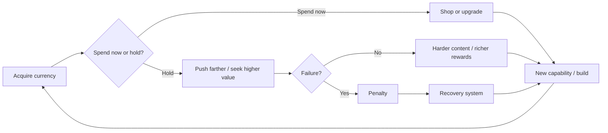
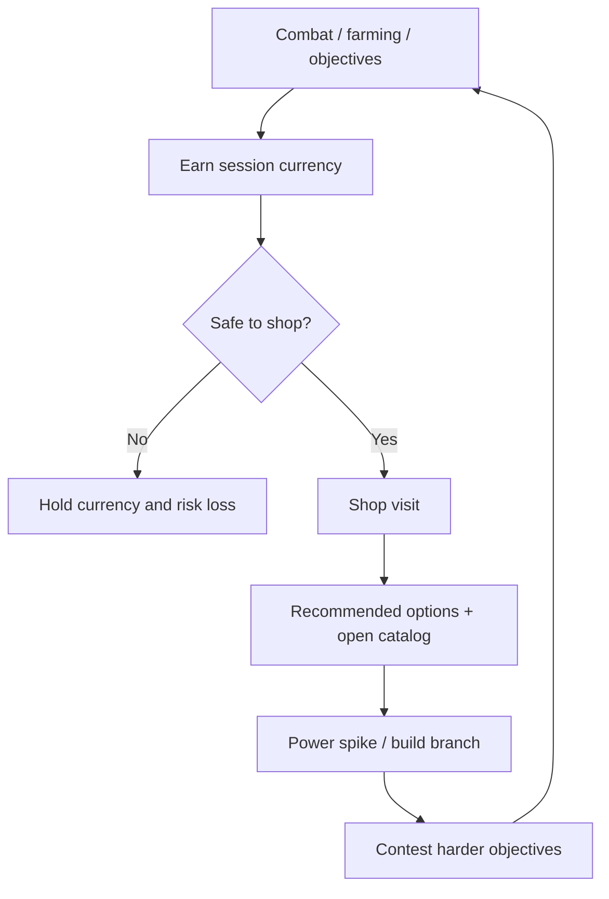
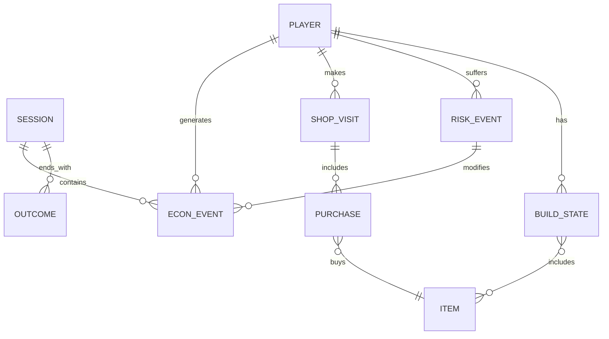

# Gold and Shop Design for Engaging Games

## Executive Summary

The strongest currency and shop systems do not merely price power. They pace decision-making, stage risk, structure recovery, and make progression legible. The three case studies here show three distinct but highly reusable models: a **short-horizon tactical economy** in *League of Legends*, where gold exists to create repeated spend windows inside a competitive match; a **high-stakes recoverable-loss economy** in *Elden Ring*, where runes are simultaneously wallet and experience, so every unspent gain becomes a psychological wager; and a **campaign-pressure economy** in *Darkest Dungeon*, where gold, heirlooms, stress, roster health, and provisioning costs all function as interlocking resources that turn every expedition into a long-form portfolio decision. citeturn3search0turn28view3turn31view0turn31view1turn34view0turn24view0turn24view3

For game design, the central lesson is that “fun” in an economy rarely comes from abundance alone. It comes from **meaningful tradeoffs at the right cadence**. League makes shopping fun by compressing choices into high-pressure timing windows and by giving players multiple item paths, recommendation tools, and systemic comeback mechanisms. Elden Ring makes spending fun by making **not spending** emotionally dangerous; the store is interesting because the field is dangerous. Darkest Dungeon makes shopping fun by moving many of the most consequential purchases to the pre-run and between-run phases, where uncertainty about future damage, stress, and attrition makes every supply or recovery decision feel consequential. citeturn28view1turn28view2turn29view0turn32view2turn31view0turn31view1turn24view0turn21view0turn24view3

The most actionable patterns are therefore: **frequent small spend windows for match games; recoverable but painful loss for adventure games; persistent meta-sinks for long campaigns; explicit recommendation layers for novices; bounded comeback subsidies to preserve hope; and hard separation between monetization and competitive power**. Where systems become unethical is not when they create tension, but when they hide odds, punish absence, personalize pressure too aggressively, or monetize solutions to pain that the designer intentionally created. The literature on prospect theory, sunk cost, reinforcement schedules, and dark patterns strongly supports designing for agency, disclosure, and recoverability rather than coercion. citeturn26search0turn26search5turn26search2turn27search4turn27search0turn27search2turn28view5

## Core design goals for currency and shop systems

A good currency system should solve five jobs at once. First, it should **translate player performance into legible progress**. Second, it should **pace power gain** so that new options arrive at satisfying intervals rather than in one undifferentiated rush. Third, it should **make planning visible**, which means currencies and prices must help players reason about future possibilities, not just current purchasing power. Fourth, it should **support recovery** after mistakes, ideally without erasing the significance of those mistakes. Fifth, it should **preserve fairness**, especially when the game also has a real-money economy. Riot’s public design writing repeatedly frames League’s item and balance work in terms of objective frameworks, build diversity, accessibility for different skill levels, and preserving competitive integrity; Bandai Namco’s official guides for Elden Ring frame runes as the universal means for leveling, buying, and strengthening; Red Hook frames Darkest Dungeon around stress, scarcity, and the psychological toll of adventuring rather than pure loot accumulation. citeturn28view0turn28view1turn28view5turn31view0turn31view2turn34view0turn21view0turn24view0

In practice, that means you should decide early which of the following economic fantasies your game wants to deliver:

| Economic fantasy | Best expression | Player impact | Implementation complexity |
|---|---|---|---|
| Tactical adaptation inside one session | Frequent gold income, many small purchases, timing-sensitive shop access | High moment-to-moment agency; high cognitive load | High |
| High-stakes exploration with recoverable loss | Unbanked hybrid currency, corpse-run or reclaim loop | Strong tension, memory, and emotional salience | Medium |
| Campaign management under attrition | Persistent gold + secondary resources + between-run services | Long-term attachment and hard tradeoffs | Medium to high |
| Collection/identity spending outside gameplay | Cosmetic store, rotating offers, disclosure of odds/max spend | Motivation through identity and novelty; fairness risk if mixed with power | Medium |

The case studies below map almost perfectly onto the first three fantasies, while League’s out-of-match cosmetics economy illustrates the fourth. citeturn28view5turn6search2turn31view5turn21view0

## Case studies

### entity["video_game","League of Legends","moba 2009"]

League, designed and operated by entity["company","Riot Games","game studio"], uses a **session-only tactical currency**. Gold is earned through lane farming, takedowns, objectives, and role-specific income systems such as the post-2024 support item quest. That support system is especially revealing: Riot consolidated support starters into World Atlas, then used charge-based gold generation and explicit upgrade thresholds to reduce confusion while still preserving role expression through later branch choices. This is a clean example of a “simple entry, expressive payoff” economy. citeturn3search0turn29view0

League’s shops are interesting because they create **timing pressure**, not just build pressure. Gold only matters when you can safely convert it into power, so the true decision is not merely *what* to buy, but *when to recall, what tempo to sacrifice, and what spike to target*. Riot’s shop overhaul explicitly aimed to serve both novices and experts through a Recommended tab driven by high-level player data, quick-buy pins, locked-item indicators, scalable UI, extended stats, and language search. This is a very strong model for any game where the catalog is large but moment-to-moment cognition is scarce. The UI does not remove mastery; it preserves mastery by reducing avoidable friction. citeturn28view1turn28view2

The system’s key engagement tool is **choice under bounded information**. Riot has said its item goals are build diversity, class-appropriate power, and objective frameworks for balancing an item system whose win-rate signals are noisier than champion win rates. That matters: if you want players to feel clever for shopping, your balance process cannot rely on naive purchase-win correlations, because items purchased when already ahead will look stronger than they are. Riot’s published item balance framework is valuable not only as a balancing article, but as a methodological warning for any designer building economy telemetry. citeturn28view0turn29view5

League’s risk/reward architecture is also unusually explicit. Objective bounties reward sufficiently losing teams for securing high-value map targets; later Riot tuning reduced overpayment, increased suppression for losing-team champion bounties, and changed calculations so gold leads matter more accurately. In 2024–2026 patches, Riot also reduced edge cases like “undeserved” bounties on losing-team farmers, devalued repeated kills, and tuned negative bounties so repeated camping yields less economic payoff. These are strong examples of **anti-snowball design that protects hope without trivializing leads**. citeturn28view3turn29view1turn28view4turn29view2turn29view3turn29view4

For anti-exploit, League shows three layers worth copying. First, it fights **economic abuse** directly: double-support item strategies were nerfed through global support-item penalties, and role-binding/position assignment changes were explicitly justified as eliminating funnel-like unhealthy strategies. Second, it fights **perception-level fairness problems** through bounty suppression and visible signals. Third, it protects competitive integrity through anti-cheat and anti-botting systems because, as Riot puts it, players will not invest in mastery if they believe automation determines outcomes. citeturn29view1turn29view4turn30view0

As a monetized game, League is a useful split example. Riot’s stated business position is that competitive success should come from play, not spending, and that cosmetics should never sell gameplay power. At the same time, League’s broader shop ecosystem includes rotating, personalized, and random cosmetic offerings. Riot says it uses safeguards such as purchase protections, refunds, daily loot limits, value framing, and maximum-spend visibility; its support materials for the Sanctum also describe low drop rates, pity-style guarantees, rotating availability, and progress carryover—classic scarcity and variable-reward techniques that are acceptable only because they remain decoupled from competitive power. citeturn28view5turn6search2

### entity["video_game","Elden Ring","action rpg 2022"]

Elden Ring, from entity["company","FromSoftware","game studio"] and published by entity["company","Bandai Namco Entertainment","game publisher"], uses a **hybrid currency**: runes are earned by defeating enemies or using items, and they are spent on leveling, buying items, and strengthening weapons and armor. Mechanically this is elegant because it merges economic and character-progression decisions into one pool; psychologically it is powerful because every unspent rune pile is also unrealized survivability or build growth. citeturn31view0turn31view2

The defining loop is the **recoverable-loss wager**. When the player dies, carried runes are dropped at the death location; if the player dies again before retrieval, they are permanently lost. Sites of Grace restore health, refill flasks, and respawn most enemies, creating a stable reset point that also re-populates the world’s risk landscape. This means the player is continuously deciding whether to bank now, push deeper, or detour to a merchant. Because the cost of greed is legible and reversible once, the economy produces tension without becoming arbitrary. citeturn31view1turn31view0

Elden Ring’s shop design is deliberately sparse. The official guides emphasize merchants, Sites of Grace, Smithing Tables, map markers, and weapon strengthening, not layered recommendation UI. That is appropriate because the game’s “shop” is not meant to solve a catalog-management problem; it is meant to punctuate exploration and reinforce route planning. The player’s real shopping decision is a pathing decision: do I clear one more camp, descend one more cave for smithing stones, or retreat to convert value? This is why the game’s economy feels exploratory rather than transactional. The official interviews with director entity["people","Hidetaka Miyazaki","game director"] reinforce this reading: he repeatedly ties the game’s design to a sense of accomplishment, freedom, adventure, unknown threats, and meaningful customization. citeturn31view2turn32view2turn31view8turn33view3

The game’s progression design is strong because it creates **three simultaneous spending horizons**: immediate consumables and merchant goods, medium-term weapon upgrades via smithing, and long-term attribute investment through leveling. The Ashes of War system deepens this by turning customization into a layer of strategic reconfiguration rather than pure linear stat gain. A practical design lesson here is that shops become more interesting when they serve multiple time horizons at once; a single “best purchase” becomes less obvious when spending can improve the next minute, the next boss, or the next ten hours. citeturn32view2turn31view2

Balance-wise, Elden Ring is the clearest example of **fair adversity over reactive rubber-banding**. Developer interviews stress that the goal is not simply high difficulty, but difficulty that feels understandable and learnable. Official patches also show a willingness to rebalance weapon classes and early stat growth, while patch 1.05 carried key Bell Bearing unlocks into NG+ so certain shop unlocks and upgrade-material access become less grindy across repeated campaigns. That is a subtle but important economy lesson: fairness is not only combat tuning; it is also how much repetitive reacquisition your store architecture demands from returning players. citeturn33view3turn31view4turn31view3

On monetization, Elden Ring is comparatively clean. The official site presents the game as a premium purchase with expansions, digital artbooks, soundtracks, and edition bundling, not a live microtransaction economy. That separation sharply limits the risk of shop psychology contaminating gameplay fairness. The economy can therefore be brutal inside the game because the designer is not also selling relief from that brutality. citeturn31view5

### entity["video_game","Darkest Dungeon","roguelike rpg 2016"]

Darkest Dungeon, from entity["company","Red Hook Studios","game studio"], is the most systemic of the three. Its official materials define it not as a loot fantasy but as a game about the stresses of dungeon crawling, the psychological vulnerability of heroes, and the need to manage not only monsters but famine, disease, darkness, and mental collapse. This framing is crucial: the “economy” is not just gold. It is **gold, heirlooms, time, stress capacity, roster depth, treatment slots, and provisions**, all competing inside a campaign loop. citeturn34view0turn21view0

The core innovation is that it turns **human fragility into a resource sink**. In the developer-authored affliction deep dive, stress is explicitly exposed as a visible meter because the team decided players needed clear feedback they could “game.” At 100 stress, heroes undergo an affliction check and often become impaired in ways that alter combat and exploration behavior; sometimes they instead enter a heroic state. To reduce stress, players must spend between missions on limited town recovery slots that also interact with hero preferences. This is a masterclass in making a support economy feel central rather than peripheral. citeturn24view0

The shop loop is split into two emotionally different phases. **Before** a run, provisioning is a forecast problem: how much food, light, utility, and risk insurance should I buy without gutting my margins? **After** a run, town spending is a triage problem: do I invest in skills, weapons, treatment, stress relief, or recruitment capacity? Game Informer’s preview makes the building logic especially clear: players bring back gold and heirlooms, upgrade the guild and blacksmith, use treatment buildings for mental afflictions, and continually choose between improving future earning power and repairing current damage. This is one of the strongest templates available for any game that wants shops to feel strategic before and after field play rather than only during it. citeturn24view3turn21view0

Darkest Dungeon’s feedback loop is also exemplary. The stress meter uses direct numerical feedback, affliction checks are staged as dramatic fullscreen moments, and the narrator reinforces both success and failure. This combination of **numerical clarity plus theatrical consequence** is why the system feels harsh without feeling silent. Players can understand the rules, but they still feel the drama. That balance between legibility and emotional weight is one of the central lessons to borrow from the game. citeturn24view0turn34view0

Unlike League, Darkest Dungeon does not solve fairness with comeback gold. It solves it with **persistent campaign progress**. Heroes can die permanently, but estate upgrades, knowledge, and roster-level decisions carry the campaign forward. Unlike Elden Ring, loss is not concentrated in a single corpse-run moment; it is distributed across the campaign in repair bills, attrition, missed opportunities, and irreversible casualties. That creates heavy sunk-cost pressure, but because the game openly presents itself as a game of frailty and hard decisions, the loop remains coherent instead of deceptive. Monetization remains separate as well: the Steam store shows a base premium purchase plus DLC and soundtrack rather than an in-game spend loop. citeturn21view0turn34view0

## Comparative synthesis

The three games can be understood as three archetypal economy loops:

In League, **G = tempo loss, shutdown risk, and contested objective windows**, while **H = comeback bounties and re-tuned kill values**. In Elden Ring, **G = dropped runes** and **H = one-chance retrieval plus stable reset points**. In Darkest Dungeon, **G = stress, affliction, attrition, and repair spending** and **H = estate persistence, roster depth, and recovery services**. The common design insight is that fun emerges when the player can feel both the cost of greed and the plausibility of recovery. If either side disappears, the system becomes either flat or cruel. citeturn28view3turn29view2turn29view3turn31view1turn31view0turn24view0turn24view3

| Game | Currency model | Acquisition | Primary sinks | Risk/reward lever | Shop/UI pattern | Player impact | Implementation complexity |
|---|---|---|---|---|---|---|---|
| League | Temporary match gold | CS, takedowns, objectives, role income citeturn3search0turn29view0 | Items, wards, timing of recalls citeturn29view0turn28view2 | Delay spending for stronger spike vs get punished before recall; bounty/comeback systems regulate swings citeturn28view3turn29view1turn29view2turn29view3 | Dense catalog with recommendations, quick-buy pins, locked-state feedback, scaling UI citeturn28view1turn28view2 | High tactical agency and high systemic readability | High |
| Elden Ring | Hybrid currency + XP runes | Enemy kills and consumable rune items citeturn31view0 | Leveling, merchant goods, smithing, gear strengthening citeturn31view0turn31view2 | Unspent runes are dropped on death and lost on second death citeturn31view1 | Sparse diegetic merchants + Grace menus + map markers citeturn31view1turn31view2 | Strong tension, memorable losses, exploratory route planning | Medium |
| Darkest Dungeon | Campaign economy with multiple coupled resources | Gold/heirlooms from expeditions; stress and attrition as negative resources citeturn24view3turn34view0 | Provisions, stress relief, treatment, skill/weapon upgrades, recruitment capacity citeturn24view3turn21view0turn24view0 | Under-provision and risk collapse; over-provision and lose margin; stress can flip heroes into afflictions citeturn24view0turn34view0 | Pre-run provisioning + between-run town services + strong theatrical feedback citeturn24view0turn24view3turn34view0 | Deep campaign attachment and hard long-horizon tradeoffs | Medium to high |

A second way to compare them is by **where they place the emotional center of spending**. League places it at **the conversion moment**: “I finally recalled; what spike do I buy?” Elden Ring places it at **the holding moment**: “How long dare I carry these runes?” Darkest Dungeon places it at **the planning and repair moments**: “How much do I risk going in, and how much damage can I afford to fix afterward?” That distinction is useful because it tells you what kind of emotion your shop should amplify: relief, fear, or dread. citeturn28view2turn31view1turn24view3turn24view0

## Actionable design patterns and adaptable templates

The tuning ranges below are **starting heuristics** derived from the case studies and generalized for implementation. They are design recommendations, not extracted values from the source games.

| Pattern | When to use it | How it works | Pros | Cons / failure modes | Starting tuning range | Metrics to track | Complexity |
|---|---|---|---|---|---|---|---|
| Tactical spend window | Match-based PvP/PvE with repeated safe-shop moments | Currency accrues continuously, but conversion requires a timing cost | Creates exciting spikes; links economy to map control or tempo | If access is too hard, spending feels frustrating; if too easy, choices flatten | First meaningful purchase in 3–7 min; 4–8 shop visits per 25–35 min session | time-to-first-purchase, average unspent currency at death, shop visit-to-purchase rate | High |
| Recoverable loss carrier | Exploration games with danger and retreat decisions | Unbanked currency is at risk on failure, but one recovery chance exists | High tension and memorability; strong route-planning | Too punitive if loss is total and recovery is unreliable | Recover 1 failure, lose on 2nd; target 30–60% of sessions experiencing “close bank” decisions | currency lost per death, reclaim success rate, quit rate after unrecovered loss | Medium |
| Forward-cost provisioning | Run-based or expedition-based games | Player prepurchases supplies under uncertainty before a mission | Great for strategic foresight and identity of “being prepared” | Easy to turn into spreadsheet drudgery | Provision spend ~15–30% of expected gross run income; 3–6 major supply categories | over/underbuy rate, abandoned-run frequency, unsold stock wastage, margin after recovery costs | Medium |
| Persistent campaign sink web | Long campaigns or roster games | Multiple sinks share one or more linked currencies across meta progression | Failure still advances campaign thinking; rich strategic expression | Over-coupling can produce overwhelm and paralysis | Top 3 sinks should absorb 70–85% of spend; no single mandatory sink should exceed ~45% of median spend unless intentionally oppressive | sink concentration, roster stagnation, respec demand, dead-currency rate | Medium to high |
| Guided open catalog | Deep item systems with novice onboarding needs | Keep a broad catalog, but add recommendations, lock states, and contextual quick-buy | Preserves mastery while lowering friction | Can make the meta feel “solved” if recommendations are too authoritative | 50–80% recommendation adoption for novices, 15–40% for experts; allow >1 viable path in common states | recommendation acceptance, deviation win rate, search usage, undo rate | Medium |
| Controlled comeback subsidy | Competitive games where hope matters | Give losing players targeted economic catch-up without removing leader advantage | Reduces surrender spiral and hopelessness | Overtuned subsidy makes all early leads feel fake | One payout should close ~8–15% of a typical deficit; full comeback path ~35–60% over several actions, not one | deficit-before/after event, comeback win rate, surrender timing, perceived fairness surveys | High |

The most reusable pattern combination is this: **one primary earning loop, two to four meaningful sinks, one visible risk lever, and one bounded recovery mechanism**. League proves the value of adding a recommendation layer when the shop is large and time pressure is high; Elden Ring proves the value of letting held currency become a wager; Darkest Dungeon proves that pre-run and between-run buying can be more emotionally effective than an always-open convenience store. citeturn28view1turn28view2turn31view1turn24view3turn24view0

### Template for a match-based tactical economy

Use this when your game wants players to improvise under pressure.

**Spec:**  
Use one main session currency; gate spend conversion behind safe zones, recalls, or spatial shops; surface at least one obvious build path and one situational counterbuild; add comeback subsidies only when a player or team is measurably behind.

**Good defaults:**  
Keep the majority of purchase decisions incremental rather than all-in; ensure at least one purchase option solves survivability and one solves tempo; separate “basic essentials” from “identity/strategy” purchases in the UI.

### Template for a recoverable-loss exploration economy

Use this when you want fear, cautious greed, and memorable stories.

**Spec:**  
One hybrid currency funds both progression and buying. Death drops held currency. The player gets a fair, readable chance to reclaim it. Rest points restore safety but also reset danger.

**Good defaults:**  
Always communicate where loss occurred; avoid hidden loss modifiers; make recovery skillful but not random; reduce repetitive late-game grind by preserving some store unlocks or upgrade access across loops.

### Template for a campaign-attrition economy

Use this when you want long-form decision pressure.

**Spec:**  
Separate the economy into three phases: **pre-run provisioning**, **in-run attrition**, and **between-run repair/investment**. Couple your currency to stress, treatment, and progression so that money is never just power—it is also recovery bandwidth.

**Good defaults:**  
Expose critical meters numerically; make consequences theatrical but not opaque; allow permanent campaign progress even when individual units are lost; keep at least one sink that improves future earning power and one that solves current pain.

### Telemetry model for implementation

Minimum event schema: `timestamp`, `source` (kill, quest, loot, objective, sale), `amount`, `pre_balance`, `post_balance`, `context_state` (HP/stress/match deficit/threat level), `shop_surface`, `recommendation_shown`, `purchase_category`, `failure_event`, `recovery_success`.

## Psychology, monetization, and ethical guardrails

The case studies line up closely with classic behavioral findings. The 1979 *Prospect Theory* paper established that people evaluate gains and losses asymmetrically; the 1985 *The Psychology of Sunk Cost* paper showed that prior investment can irrationally encourage continued commitment; reinforcement-schedule research showed why variable-ratio rewards are sticky. In games, those mechanisms become especially potent when currency is both progress and identity. Elden Ring’s dropped runes are a textbook loss-aversion trigger; Darkest Dungeon’s heavy investment in supplies, heroes, and treatment creates strong sunk-cost pressure; League’s live-service cosmetics economy uses scarcity, rotation, and sometimes randomized reward structures to keep optional spending salient. citeturn26search0turn26search5turn26search2turn31view1turn24view0turn6search2

What matters is not whether these hooks exist, but **what they are attached to**. Loss aversion can be beneficial when it deepens tactical meaning, as in Elden Ring’s corpse-run loop, or when it gives preparation emotional weight, as in Darkest Dungeon. It becomes suspect when the designer sells relief from pain they intentionally created, or uses personalized pressure to intensify spending. This is why League’s fairness line matters so much: Riot explicitly says winning should come from play, not spending, and cosmetics should not grant power. That separation does not eliminate ethical concerns around rare-content shops, rotating offers, or randomized cosmetics, but it does prevent those mechanics from compromising competitive integrity. citeturn28view5turn6search2

A practical ethical framework is therefore:

| Question | Healthy answer | Warning sign |
|---|---|---|
| Does spending buy power over other players? | No, or only in clearly bounded PvE contexts | Yes, especially in ranked/competitive modes |
| Are odds, pity timers, caps, and max spend visible? | Fully disclosed and easy to inspect | Hidden, shifting, or hard to understand |
| Is pain recoverable through play alone? | Yes, with legible recovery paths | Relief is primarily sold |
| Does the game punish absence or missed sessions? | Mild opportunity cost at most | Severe FOMO, decaying value, or loss-framed pressure |
| Are recommendations helping, or steering toward monetization? | Improve usability in power-neutral contexts | Interleave store pressure with cognitive overload moments |

Recent consumer-protection guidance on dark patterns consistently warns against interfaces that steer, coerce, or manipulate users against their interests, and regulations such as the EU Digital Services Act explicitly prohibit deceptive dark-pattern tactics. U.S. regulators have also tied enforcement in games to deceptive purchase design and unclear reward-cost structures. For a designer, the operational rule is simple: **make your economy dramatic, but not deceptive**. citeturn27search4turn27search2turn27search0turn27search6

## Final design principles

If you are designing a new game, the most robust synthesis from these case studies is:

1. **Choose one emotional center for spending.**  
   Make the shop feel like relief, temptation, or triage—but pick one dominant emotion and reinforce it consistently. League uses relief and spike timing; Elden Ring uses fear of loss; Darkest Dungeon uses triage and attrition. citeturn28view2turn31view1turn24view3

2. **Let currency pace content, not just price items.**  
   Players should feel purchases arriving as beats in the game’s rhythm. If everything is always affordable or nothing is, your economy is not pacing anything. citeturn29view0turn31view2turn24view0

3. **Make loss fair, visible, and recoverable enough.**  
   Fair loss creates engagement; opaque loss creates resentment. If you want tension, telegraph the rules, show state changes clearly, and give players a plausible path back. citeturn24view0turn31view1turn33view3

4. **Keep the catalog broad, but reduce interface friction.**  
   Recommendations, lock states, quick-buy affordances, and visible meters are not “casualization”; they are how you preserve decision quality under pressure. citeturn28view1turn28view2turn24view0

5. **Balance with behavioral telemetry, not naive averages.**  
   Track when an item is bought, by whom, while ahead or behind, and after what risk events. Riot’s public item-balance reasoning is a strong example of why raw win-rate data is insufficient for shop tuning. citeturn28view0

6. **Separate monetization from competitive power.**  
   If your game is PvP or mastery-forward, this is the single most important fairness rule. Cosmetic monetization can still use excitement, identity, and scarcity—but it should never be the source of competitive advantage. citeturn28view5

7. **Design for campaign resilience or match hope.**  
   If your structure is long-form, let setbacks still advance something persistent. If your structure is match-based, let losing players still see a path back. Darkest Dungeon and League reach the same psychological endpoint—continued engagement after pain—through different economic tools. citeturn24view3turn28view3turn29view2turn29view3

The broad conclusion is that gold and shop mechanics are most engaging when they are treated as **decision architecture**, not vending machines. The case studies differ wildly in genre, pace, and audience, but they converge on the same underlying truth: players enjoy economies when money expresses mastery, danger, and authorship over a build or campaign. They resent economies when money merely delays play or monetizes suffering. Build for the former, measure relentlessly, and keep the system honest. citeturn28view5turn33view3turn24view0turn28view0