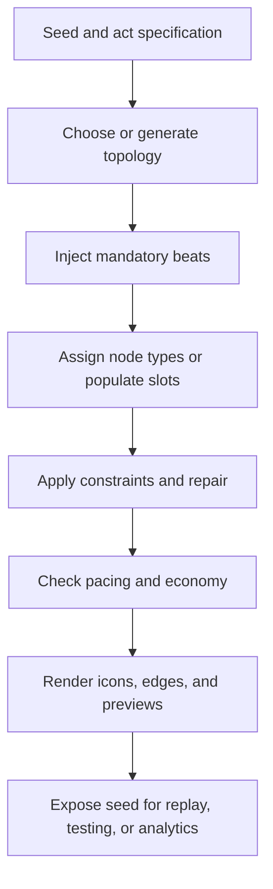
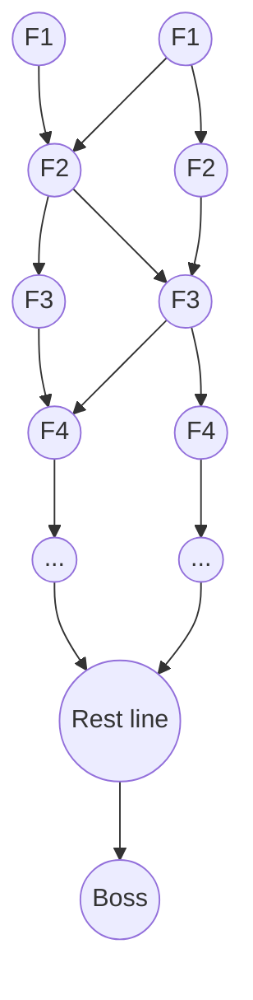

# Map Design in Turn-Based Roguelike and Roguelite Games

## Executive Summary

Map design in turn-based roguelike and roguelite games is not just navigation; it is a compact decision engine that converts uncertainty into agency. In games such as entity["video_game","Slay the Spire","2019 deckbuilder"], the map mediates nearly every important strategic tradeoff: how much risk to absorb now, when to cash out for recovery, how to sequence upgrades and fights, and how to hedge against unknown future states. This aligns with classic game-design theory that links mechanics to dynamics and then to player-facing aesthetics such as challenge, discovery, and tension, and it also matches curiosity research showing that uncertainty can increase engagement when players believe they can meaningfully act on it. citeturn16view2turn37view0turn16view0

The most enjoyable maps in this subgenre tend to share seven properties. They expose topology clearly enough for planning, differentiate node types with strong semantic meaning, place high-value rewards behind legible risk, preserve multiple viable paths rather than a single dominant line, stage a visible pacing curve, communicate route information at a glance, and produce enough variation that deck state and map state interact differently from run to run. In Slay the Spire specifically, academic work on map uncertainty and player logs suggests that the map is not a peripheral UX feature but one of the central places where player skill expresses itself, especially in later acts when stronger players take more calculated and less entropic paths. citeturn16view0turn40view0turn38view0

Algorithmically, commercially shipped games in this space are usually closer to **constructive procedural generation with repair constraints** than to fully search-based optimization. The common pattern is: start from a seed, generate or choose a topology, inject mandatory beats, assign node types with weighted randomness, enforce playability and pacing constraints, then expose the result through an intentionally readable visual grammar. Research literature strongly supports graph grammars, constraint solving, and search-based PCG as powerful alternatives or offline tooling, but in the public materials I found for the compared shipped games, the clearest evidence is for weighted selection, seeded RNG, templates, graph-like mission structures, and hand-authored constraints rather than runtime simulated annealing or genetic optimization. citeturn17view0turn16view3turn18view0turn41search9turn41search12turn41search21

The comparison with four other turn-based examples shows a useful spectrum. **Monster Train** pushes toward a highly authored, ring-based branching template; **Griftlands** turns the map into a mutable quest graph with mission-dependent locations; **Dicey Dungeons** uses small floor templates and spatial overworld routing; **Tangledeep** uses classical procedural dungeon generation with heavy parameterization, templates, terrain affordances, and hand-authored injections. Slay the Spire sits in the middle of this spectrum: more procedurally variable than Monster Train’s ring templates, more abstract and acyclic than Tangledeep’s spatial floors, and more strategically transparent than quest-heavy Griftlands. citeturn24view0turn24view1turn26search3turn26search1turn29view0turn29view1turn31view0turn32view0turn33search2

## Why These Maps Feel Good

A strategic roguelike map is enjoyable when it turns randomness into **interpretable risk** rather than opaque luck. The key move is not “adding more branches,” but making the branches meaningful. MDA frames this as mechanics producing dynamics that then create aesthetics such as challenge and discovery; curiosity research sharpens the point by arguing that players enjoy uncertainty when they see a plausible path for resolving the information gap. In node-map roguelites, the result is a satisfying loop: the player scans icons, forecasts resource needs, chooses a route, and later evaluates whether that route solved the run’s current problem. citeturn16view2turn37view0

Topology matters because it determines the **shape of future option value**. A nearly linear map gives consistency but lowers agency. A highly branching acyclic map creates strong commitment without the bookkeeping of backtracking. Loops and revisitable nodes create richer planning and stronger local optimization, but they also raise cognitive load and reduce the clean “one decision per floor” cadence that makes Slay the Spire so readable. Research on graph-based map generation mirrors this design intuition: mission graphs and topological graphs are useful precisely because they let designers reason separately about progression structure and spatial realization. citeturn16view3turn18view0turn41search21

Node types are enjoyable when they create **distinct economic roles**. Combat is baseline progression. Elites are volatility plus acceleration. Shops are conversion nodes that turn gold into deck quality or tempo. Events add uncertainty and surprise. Rest sites are controlled recovery or delayed power. This division matters because it lets the player regulate difficulty mid-run rather than only at coarse global difficulty settings. In Slay the Spire, both academic analysis and ML-assisted pathing work point to the importance of room types such as elites and campfires in successful path choice, which is exactly what players experience intuitively: a route is good not only because of how many nodes it contains, but because of the *sequence* and *spacing* of those node types. citeturn16view0turn40view0

Risk-reward placement is the point where map design most directly contributes to enjoyment. When strong rewards are legibly attached to danger, the map offers voluntary self-escalation. Anthony Giovannetti’s own retrospective description of Slay the Spire’s core as “risk versus reward,” including discussions of map layouts and the cadence of fights, treasures, and upgrades, is revealing here: players enjoy the map because it constantly asks, “How greedy can you afford to be?” rather than simply “Which icon do you like most?” citeturn38view0turn15search3

Pacing and difficulty curves emerge from map structure at least as much as from enemy stats. Fixed early safety, mid-act volatility, and pre-boss consolidation are all map-level pacing tools. Slay the Spire’s map generator, for example, effectively guarantees a calmer opening and then ramps access to elites and rest sites later, which produces a clean difficulty arc even before encounter specifics are sampled. The 2025 uncertainty analysis is especially useful here: stronger players were not simply “more random” in their decisions; in later acts they tended toward more calculated path selection, suggesting that good maps support mastery by letting players deliberately tune uncertainty over time. citeturn21view0turn20view1turn16view0turn39search11

Visual affordances are the usually under-discussed half of this system. A map only produces good strategy if players can parse it quickly. Node silhouette, icon distinctiveness, vertical layering, crossing control, and predictable floor landmarks all reduce search cost. This is why many successful games sharply limit the number of node semantics on screen and strongly regularize layout. The pleasure is partly cognitive economy: the player feels smart because the UI makes strategic intent legible without removing uncertainty. That tradeoff is one of the most important design lessons in this genre. citeturn20view1turn24view0turn29view0turn31view0

Replayability and emergent strategy follow from the interaction between **run state** and **map state**. The same topology can be easy for a scaling deck and terrifying for a fragile tempo deck. Unknown rooms are more attractive when HP is high and a key upgrade is already secured. Shops matter more when a path yields gold first. This is why the map remains interesting after players memorize the node meanings: the strategic content is combinatorial, not merely cosmetic. Academic work on uncertainty in Slay the Spire and other studies on path heuristics both support this view that path success depends on contextual tradeoffs rather than static room desirability alone. citeturn16view0turn40view0turn36search0

## How These Maps Are Generated

The most useful way to think about generation in this genre is as a pipeline from **seed → topology → semantics → constraints → readability**. A seed guarantees reproducibility. A topology generator creates a candidate graph or spatial floor. A semantics pass assigns node meanings or fills item and encounter slots. A constraints pass repairs degenerate cases, such as repeated premium nodes, impossible progress, or broken pacing. A final rendering pass translates graph structure into icons and route affordances the player can actually use. This general decomposition is consistent with PCG surveys, dormitory-to-space graph work by entity["people","Joris Dormans","pcg researcher"] and colleagues, and broader overviews of constructive versus generate-and-test generation. citeturn17view0turn16view3turn41search1



The pipeline above summarizes the constructive pattern that best fits the public evidence for the compared commercial games, especially Slay the Spire, Monster Train, Dicey Dungeons, and Tangledeep. citeturn21view0turn24view0turn29view1turn31view0

A second useful distinction is **graph-first** versus **space-first** generation. Graph-first systems first decide the order and dependency structure of decisions, then realize that structure visually or spatially. This is the dominant model for Slay the Spire-like node maps. Space-first systems generate a physical floor and then populate it with semantically meaningful interactions; Tangledeep leans more strongly this way. Dormans explicitly argues for separating the generation of a mission graph from the generation of space, while later work extends graph grammars with probabilities so designers can shape output distributions more directly. citeturn16view3turn18view0

Weighted random selection is the workhorse technique in shipped systems because it is cheap, expressive, and easy to debug. The generator can keep a “bucket” of node types or item categories, shuffle or sample from weighted probabilities, and then repair outcomes that violate constraints. This matches the reverse-engineered Slay the Spire implementation almost exactly, and it also resembles the item and rule loading patterns documented for Dicey Dungeons. Weighted randomness is especially attractive because it allows both designer control and player-facing unpredictability. citeturn21view0turn29view1turn30search4

Constraint satisfaction is where these designs become playable. Constraints can be explicit hard rules, such as “elite and rest nodes cannot appear too early,” “sibling branches should diversify node types,” or “critical content must remain reachable.” In PCG research, constraint reasoning and declarative solvers are widely used to guarantee playability or expressive range; in commercial games, the same logic often appears as hand-coded repair rules rather than as a full SAT/SMT pipeline. The design point is the same: randomness is allowed, but only inside a box that preserves fairness, pacing, and readability. citeturn41search9turn41search12turn41search17turn41search21

Seeded RNG is another quiet but important ingredient. It supports reproducibility for debugging, daily challenges, community sharing, analytics, and reverse engineering. Slay the Spire exposes seeds in run history and custom mode, and both player research and community tooling rely on those seeds to reconstruct maps. Seeded generation also lets designers compare alternate algorithms on the same latent randomness, which is invaluable for balancing map quality. citeturn19search11turn34search9turn16view0turn19search0

Meta-heuristics such as genetic algorithms, simulated annealing, and quality-diversity search are highly relevant in the research literature, but they appear mostly as **offline generate-and-test approaches** rather than as publicly documented runtime generators in the compared shipped games. entity["people","Julian Togelius","pcg researcher"] and coauthors explicitly frame search-based PCG as a graded generate-and-test family better suited to offline exploration when correctness and runtime guarantees matter. More recent work on evolutionary dungeon generation, constrained expressive range, and quality-diversity reinforces this: these methods are powerful for exploring design spaces, enforcing higher-level qualities, or generating designer-facing candidate sets, but I did not find primary-source evidence that Slay the Spire, Monster Train, Griftlands, Dicey Dungeons, or Tangledeep publicly disclose runtime use of simulated annealing or genetic search for their shipping map systems. citeturn17view0turn41search11turn41search15

### Algorithm families and where they fit

| Technique | Best fit in this genre | What it buys the designer | Evidence in the compared set |
|---|---|---|---|
| Weighted random selection | Node-type assignment, item pools, event pools | Fast variety with controllable frequencies | Clearly visible in Slay the Spire; strongly suggested in Dicey Dungeons; present in Monster Train event variation. citeturn21view0turn29view1turn24view0 |
| Hard constraints / repair rules | Pacing and fairness | Prevents impossible, repetitive, or unreadable outcomes | Explicit in Slay the Spire reverse engineering; conceptually aligned with Monster Train’s ring guarantees. citeturn21view0turn20view1turn25view0 |
| Seeded RNG | Reproducibility, dailies, analytics, community sharing | Debuggability and replay comparability | Clear in Slay the Spire materials and data work. citeturn34search9turn19search11turn19search0 |
| Graph grammars / mission graphs | High-level topology control | Lets designers shape dependency structure before spatialization | Strongly supported in PCG literature; not publicly disclosed for the compared commercial games. citeturn16view3turn18view0 |
| CSP / declarative constraint solving | Guaranteeing reachability and structure | Strong control when outputs must satisfy specific design conditions | Common in research; not clearly disclosed in the compared games. citeturn41search9turn41search12turn41search21 |
| Meta-heuristics | Offline exploration, expressive-range tuning | Finds diverse high-quality candidates across a design space | Important in research, but not publicly evidenced as a live runtime method here. citeturn17view0turn41search11turn41search15 |

## Slay the Spire as the Reference Case

Public discussion by entity["organization","Mega Crit","game studio"] founders entity["people","Anthony Giovannetti","game designer"] and entity["people","Casey Yano","game designer"] consistently frames Slay the Spire as a game about route-dependent risk, reward cadence, and replayable decision depth. Anthony’s 2024 design discussion explicitly characterized the game’s core as “risk versus reward” and included discussion of map layouts and the rhythm of upgrades, treasures, and fights. Meanwhile, the team’s GDC talk on metrics-driven balance confirms a design culture where large-scale telemetry was used to tune key systems. That combination—tight philosophy plus data-driven balancing—is exactly what one would expect from a map system whose job is to present many viable but nonequivalent paths. citeturn38view0turn15search3

The clearest technical description comes from community reverse engineering and later summaries. The reported algorithm starts from a **7×15 irregular layered grid**. It draws six path passes from the first floor upward, each time connecting a node to one of the three nearest candidates on the next floor while forbidding edge crossings; early-start rules ensure at least two distinct openings, and unreachable nodes are trimmed afterward. Once topology is fixed, the generator injects mandatory beats: first-floor nodes are regular combats, floor 9 is treasure, floor 15 is rest, and the boss is attached above the top rest line. The remaining node types are filled from a weighted bucket and repaired against adjacency and floor constraints. citeturn21view0turn20view1

The weighted bucket itself is especially informative because it reveals design priorities directly. The reverse-engineered breakdown reports shop nodes at 5%, rest at 12%, event at 22%, and elite at 8%, with elites multiplied by 1.6 at Ascension 1 or higher. Additional rules then prevent elites and rests too early, avoid consecutive premium nodes of certain types, force sibling branches to diversify, and keep rest sites away from the floor immediately below the boss. In other words, the generator does not merely “sprinkle icons randomly”; it encodes a pacing philosophy: early stabilization, mid-act volatility, top-of-act consolidation, and local branch differentiation. citeturn21view0turn20view1

That pacing model is one major reason the map feels good. The player sees a route problem with enough regularity to reason about but enough uncertainty to stay tense. Known floors such as the guaranteed treasure and pre-boss rest act as anchors. Events and elites create volatility spikes. Branch divergence creates option value. If one path offers two elites but no recovery, and another offers a shop after a hallway fight, the map has successfully turned deck state, HP state, relic state, and gold state into route meaning. This is precisely the kind of uncertainty-management problem formalized in the 2025 information-theoretic study of Slay the Spire maps. citeturn16view0turn38view0turn40view0

A useful way to visualize Slay the Spire’s topology is as an **acyclic layered graph** with constrained divergence and occasional convergence:



This abstraction captures why the system is strategically rich but cognitively manageable: there are branches, but no persistent loops; there is convergence, but not arbitrary graph density; and there are deterministic landmarks at meaningful thresholds. The structure is ideal for “one step of planning plus contingent replanning” rather than exhaustive search. citeturn21view0turn20view1

The generator also explains Slay the Spire’s unusually strong replayability. Because the topology, node types, encounters, and rewards are all seeded and recombinable, the same combat system produces very different route values across runs. The 77-million-run data release and subsequent academic analyses show why this matters: path choice is not noise around the “real game,” but a major site of skill expression and outcome variance. The map is enjoyable because it transforms one run-level question—*how do I beat the act?*—into a series of local but interdependent route decisions. citeturn19search0turn16view0turn40view0

### Slay the Spire-like pseudocode

```text
function GenerateStSAct(seed, ascension):
    rng = RNG(seed)
    grid = empty layered grid with 7 columns and 15 floors

    repeat 6 times:
        start = random node on floor 1
        if this is one of first two passes:
            enforce distinct opening start
        current = start
        for floor in 1..14:
            candidates = up to 3 nearest nodes on next floor
            next = random valid candidate with no edge crossing
            connect(current, next)
            current = next

    trim unreachable rooms
    reduce problematic early convergences
    reachable = all connected rooms

    assign mandatory types:
        all floor-1 rooms = combat
        all floor-9 rooms = treasure
        all floor-15 rooms = rest

    bucket counts from weights:
        shop = 0.05
        rest = 0.12
        event = 0.22
        elite = 0.08 * (1.6 if ascension >= 1 else 1.0)
        fill remaining count with normal combat
        shuffle(bucket)

    for each reachable untyped room:
        try bucket entries in order until constraints hold:
            - elite/rest not before floor 6
            - rest not on floor 14
            - elite/shop/rest not consecutive from parent
            - sibling outgoing destinations should differ
        if none fit:
            leave blank for fallback fill

    fill remaining reachable blanks with normal combat
    connect top rest line to act boss
    return rendered map
```

The pseudocode above is a close synthesis of the reverse-engineered descriptions and summaries, not an official source release. citeturn21view0turn20view1

## Comparison Across Other Turn-Based Roguelikes

The best way to compare the field is not by asking which map is “most random,” but by asking **what kind of strategic question the map asks the player**. Slay the Spire asks a layered acyclic route question. Monster Train asks a ring-template selection question with strong shop and upgrade guarantees. Griftlands asks a quest-and-relationship navigation question. Dicey Dungeons asks a compact floor-routing and resource-conversion question. Tangledeep asks a spatial exploration and tactical positioning question. These are all map designs, but they distribute agency and uncertainty very differently. citeturn24view0turn26search3turn29view0turn31view0

image_group{"layout":"carousel","aspect_ratio":"16:9","query":["Slay the Spire map screenshot","Monster Train map screenshot","Griftlands map screenshot","Dicey Dungeons map screenshot","Tangledeep dungeon screenshot"],"num_per_query":1}

### Comparison table

| Game | Topology | Node or room semantics | What the map mainly optimizes for | Public evidence on generation |
|---|---|---|---|---|
| StS | Layered, acyclic, branching with controlled convergence | Combat, elite, shop, event, treasure, rest, boss | Voluntary risk-taking, path timing, deck-state adaptation | Reverse engineering shows a seeded constructive generator with weighted node buckets and repair constraints. citeturn21view0turn20view1turn16view0 |
| entity["video_game","Monster Train","2020 deckbuilder"] | Ring-based progression; ring 1 single path, later rings two branches plus some shared slots | Merchants, banners, vortices, caverns, boons, trinkets, boss fights | Strongly authored pacing and deterministic upgrade windows | Official and community docs show fixed ring structure plus random event variation, implying a templated constructive generator. citeturn24view0turn25view0turn25view2turn24view1 |
| entity["video_game","Griftlands","2021 deckbuilder"] | Character-specific campaign maps; mission-dependent locations with some random event unlocks | Jobs, locations, factions, negotiations, combat encounters, permanent nodes | Narrative choice, social consequence, and route relevance to current objectives | Official materials emphasize unique campaign maps, alternate quests, and new locations; community documentation indicates some random events unlock permanent nodes. citeturn26search3turn26search1turn26search0 |
| entity["video_game","Dicey Dungeons","2019 roguelike"] | Small spatial floor templates by size; overworld traversal rather than a pure node ladder | Enemies, chests, apples, shops/anvils, exits, special rules | Micro-routing, resource pickups, and floor-level tempo | Official wiki shows floor-size progression, template libraries, fixed legends, and “?” slots for extra randomized loads. citeturn29view0turn29view1turn29view2turn30search4 |
| entity["video_game","Tangledeep","2018 roguelike"] | Fully spatial procedural floors with multiple generation styles and handcrafted injections | Rooms, corridors, terrain, monsters, champions, secret areas, boss floors | Tactical positioning, exploration, and emergent battlefields | Developer posts describe XML-driven parameters, room templates, cellular-automata-style caves, multiple generation functions, and handcrafted special floors. citeturn31view0turn32view0turn33search2turn33search17 |

The most interesting contrast is between Slay the Spire and Monster Train. Both are turn-based deckbuilders with route maps, but Monster Train’s public-facing structure is more heavily templated by ring. Ring-specific guarantees—early access to champion upgrades, merchants, banners, and late-run fixed high-impact nodes—compress uncertainty and make route planning less about “What could this act randomly become?” and more about “Which of the authored value packages best fits my build right now?” This likely improves clarity and reduces dead-run variance, but it also narrows the combinatorial explosiveness that makes Slay the Spire route-reading so deep. citeturn24view0turn25view2turn24view1

Griftlands changes the function of the map more radically. Official materials stress that each character has a unique map to explore and exploit, while update notes for Smith emphasize alternate quests and a unique location set. Community documentation further indicates that many nodes are mission-dependent and that some random events unlock permanent locations. The resulting design shifts the player’s pleasure from route optimization toward **route relevance**: the interesting question is often not “How many elites can I take?” but “Which social, narrative, and deck-building consequences do I want to trigger?” Algorithmically, that looks less like weighted room buckets and more like a quest graph with stochastic unlocks and authored dependencies. citeturn26search3turn26search1turn26search0

Dicey Dungeons compresses the problem in a different direction. Its official wiki documents a library of floor maps grouped by size, with a typical episode progression of tiny → small → normal → normal → big → boss. The maps expose a legend for enemy, chest, apple, shop/anvil, and exit positions, and they mark some slots with “?” to show where extra items or enemies may load later. That produces a map design that is more local and tactile than Slay the Spire’s abstract ladder. Spatial proximity matters; pickup sequencing matters; and because floor templates are small, the game can afford denser local affordances without overwhelming the player. It is a good example of how replayability can come from *template variation plus stochastic slot filling* rather than from a large branching graph. citeturn29view0turn29view1turn29view2turn30search8turn30search6

Tangledeep sits closest to traditional roguelike map generation. The developer describes a data-driven system using many XML parameters, multiple generation functions, room templates, cellular-automata-style cave settings, variable corridor density, and handcrafted special floors. Separate design notes emphasize that the goal is not merely random geography but more tactical combat: different map types, terrain interactions, and champion modifiers create “emergent battlefields” and prevent pure corridor “conga lines of death.” This is important because it shows a different route to enjoyment. Slay the Spire’s map produces satisfaction through strategic macro pathing; Tangledeep’s map produces satisfaction through local tactical state changes inside spatially procedural rooms and corridors. citeturn31view0turn32view0turn33search2

Across these examples, visual affordances follow topology. Slay the Spire and Monster Train emphasize icon legibility and branch readability because the player is making abstract route commitments. Dicey Dungeons emphasizes small-scale spatial scanning because the player is weaving through a compact floor. Tangledeep emphasizes terrain readability and encounter telegraphing because route quality depends on positional tactics. In each case, the “right” visual language is the one that makes the map’s dominant decision type cheap to parse. That conclusion is partly an inference from the documented structures above, but it is a strong and useful one for design practice. citeturn20view1turn24view0turn29view1turn32view0

## Practical Design Patterns

A designer building a Slay the Spire-like map should usually start with **topology before content**. Decide whether the game benefits most from acyclic branch commitment, spatial backtracking, or a quest graph. If the dominant pleasure is “reading the run,” use a layered acyclic graph. If the dominant pleasure is exploration or tactics, let spatial topology carry more weight. This is exactly the separation advocated in mission/space graph work, and it is the cleanest way to avoid mixing strategic and navigational complexity accidentally. citeturn16view3turn18view0

A second pattern is to treat node types as **economic verbs**, not flavor labels. “Elite” should mean acceleration plus danger. “Rest” should mean delayed power or recovery. “Shop” should convert money into precision. “Event” should inject uncertainty and occasional discontinuities into the economy. If these semantics are fuzzy, path choice becomes noisy. If they are crisp, pathing becomes enjoyable even on simple topologies because the player can infer consequences quickly. Slay the Spire is the strongest positive example; Monster Train’s ring guarantees show the more authored end of the same principle. citeturn21view0turn24view0turn38view0

A third pattern is to make difficulty scaling primarily a function of **spacing and sequencing**, not only of enemy stats. Players experience pacing through the intervals between risk spikes and recovery windows. Reserve some nodes for mandatory beats, some for weighted variety, and some for constraints that enforce a sane arc. This is one of the biggest practical lessons from Slay the Spire’s reverse-engineered generator and from Tangledeep’s heavy parameterization of corridor counts, terrain density, and monster placement. citeturn21view0turn31view0

A fourth pattern is to expose **seeded reproducibility** wherever possible. It helps developers debug fairness, lets communities share interesting runs, and makes research and balance work vastly easier. Slay the Spire’s huge run-history ecosystem is a demonstration of how much design insight becomes possible when a map system is reproducible at seed level. citeturn19search0turn34search9turn40view0

A fifth pattern is to reserve meta-heuristics for the right layer. If a game needs strictly viable runtime maps with fast generation, constructive methods with repair constraints are often the correct production choice. If a studio wants to explore broad expressive range, discover candidate generators, or tune for difficulty envelopes offline, search-based PCG, evolutionary methods, and quality-diversity are more appropriate. Research repeatedly validates those methods, but the compared shipped games suggest that “simple generator + good constraints + clear UI” is often the commercial sweet spot. citeturn17view0turn41search15turn41search11

### Generic pseudocode for a strategic roguelike map

```text
function GenerateStrategicMap(spec, seed, player_model=None):
    rng = RNG(seed)

    # 1. Choose structure
    if spec.mode == "layered_graph":
        topo = generate_layered_topology(spec.topology_rules, rng)
    elif spec.mode == "spatial_floor":
        topo = generate_spatial_layout(spec.space_rules, rng)
    elif spec.mode == "quest_graph":
        topo = instantiate_authored_graph(spec.story_rules, rng)

    # 2. Inject mandatory beats
    topo = place_mandatory_nodes(topo, spec.mandatory_beats, rng)

    # 3. Assign semantics
    for slot in topo.unassigned_slots:
        slot.type = weighted_pick(spec.node_weights, rng)

    # 4. Enforce constraints
    topo = repair_until_valid(
        topo,
        constraints = [
            reachability,
            no impossible pacing cliffs,
            no degenerate repetition,
            visual readability,
            economy bounds
        ],
        rng = rng
    )

    # 5. Optional offline optimization
    if spec.offline_search:
        topo = improve_with_search(
            topo,
            objective = spec.objective_fn,
            method = spec.search_method
        )

    # 6. Render affordances
    return attach_icons_edges_previews(topo, spec.visual_grammar)
```

This pseudocode reflects the common constructive pipeline in the commercial examples, while leaving room for offline grammar learning, constraint solving, or search-based refinement from the PCG literature. citeturn17view0turn16view3turn18view0turn41search9

## Sources

### Primary developer and official materials

- Anthony Giovannetti interview summary discussing Slay the Spire’s map layouts, route decisions, and the game’s “risk versus reward” core. citeturn38view0
- GDC session abstract for **“Slay the Spire: Metrics Driven Design and Balance.”** Useful as evidence of the team’s data-driven balancing approach. citeturn15search3
- Monster Train official platform description, including route choice and different location benefits. citeturn24view1
- Monster Train community wiki documentation of ring structure, guaranteed nodes, and event availability by ring. citeturn24view0turn25view0turn25view1turn25view2
- Griftlands official Steam page describing unique maps, factions, locations, and run-to-run variation. citeturn26search3
- Griftlands official “Introducing Smith” update describing a unique map, new locations, and alternate quests. citeturn26search1
- Dicey Dungeons official wiki entries on map families, floor-size progression, slot legends, rules, and item acquisition. citeturn29view0turn29view1turn29view2turn30search4turn30search8turn30search6
- Tangledeep official store page emphasizing mixed handcrafted and procedurally generated gameplay. citeturn33search2
- Tangledeep developer posts on parameterized procedural generation, templates, multiple algorithms, terrain, and emergent battlefields. citeturn31view0turn32view0

### Community reverse engineering and empirical data

- Reverse-engineered Slay the Spire map generation post, including topology passes, weighted room buckets, and assignment constraints. citeturn20view2turn21view0
- Steam guide summarizing the same Slay the Spire map structure in a more tutorial format. citeturn20view1
- Slay the Spire internal metrics dump announcement describing the 77-million-run dataset used by later researchers. citeturn19search0
- Slay the Spire map-pathing bachelor thesis showing the importance of elites and campfires in successful pathing. citeturn40view0

### Research and theory

- Hunicke, LeBlanc, and Zubek’s MDA framework, especially the connection between mechanics, dynamics, and aesthetics like challenge and discovery. citeturn16view2
- To, Ali, Kaufman, and Hammer on curiosity and uncertainty in game design. citeturn37view0
- Bazzaz et al. on uncertainty in Slay the Spire paths and how risk-taking differs by player skill and act. citeturn16view0turn39search11
- Togelius et al. on search-based procedural content generation, including constructive versus generate-and-test distinctions and when search is appropriate. citeturn17view0
- Dormans on level design as model transformation, including mission graphs, branching structures, and graph-to-space generation. citeturn16view3
- Guiding probabilistic graph grammars of mission graphs via examples; useful for controlled branching structure generation. citeturn18view0
- Hendrikx et al. survey on procedural content generation in games. citeturn41search1
- Game AI Pro overview noting the role of constraint satisfaction in procedural generation. citeturn41search9
- Horswill on fast procedural level population with playability constraints. citeturn41search12
- Smith et al. on graph-based generation of acyclic dungeon levels via declarative constraint solving. citeturn41search21
- Pereira et al. on evolutionary generation of dungeon maps with locked-door missions. citeturn41search11
- Gravina et al. on quality-diversity for procedural content generation. citeturn41search15