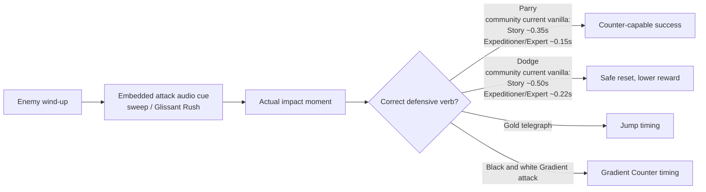
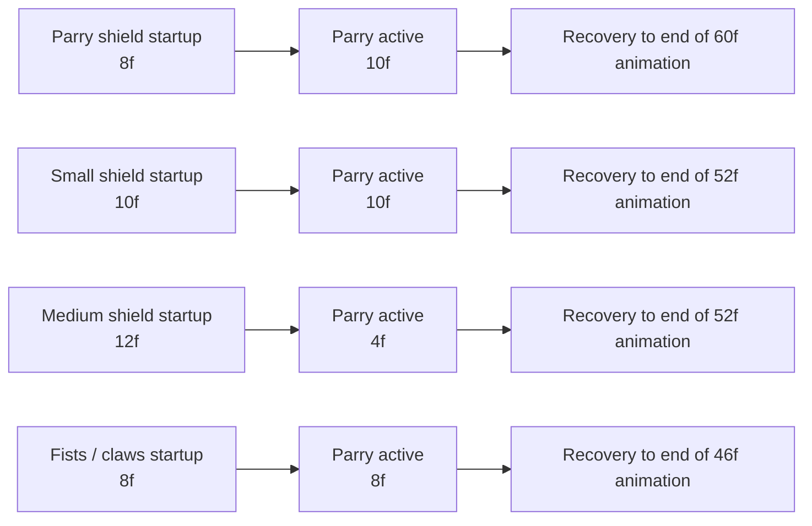

# Why Parrying Feels Good in Clair Obscur: Expedition 33 and Dark Souls 3

## Executive Summary

Both games make parrying enjoyable by turning defense into offense, but they do it through almost opposite design philosophies. *Clair Obscur: Expedition 33* makes parry a central, authored, rhythm-heavy layer inside a “reactive turn-based” combat system; the player is expected to dodge, jump, parry, and counter during enemy turns, and the game uses built-in audiovisual timing cues plus a safer dodge fallback to make the loop learnable. *Dark Souls 3* makes parry a more selective, tool-specific, higher-variance gamble: different shields and weapons have materially different startup, active, and recovery properties, and the reward is the game’s extremely strong riposte ecosystem. citeturn10view0turn36view0turn19view0turn33view0

What makes *Clair Obscur* fun is that the parry is systemic, legible, and narratively compatible with the whole combat grammar: standard parries, jump responses, and later Gradient Counters all feel like different “verbs” in one authored timing language. What makes *Dark Souls 3* fun is that parry is not universal or fully safe: it is a specialized read, shaped by tool choice, matchup knowledge, and in PvP even by connection quality, which gives every successful parry a strong feeling of domination and judgment rather than mere execution. citeturn37view1turn40view0turn40view1turn34search2turn31search11turn21search16turn21search9

The strongest design lesson across both games is not “make parries generous.” It is: give the player a clear timing language, a meaningful fallback, a reward that materially changes tempo, and a tightly managed list of exceptions. *Clair Obscur* proves this in a single-player, latency-free context; *Dark Souls 3* proves that even a riskier, narrower parry can stay fun when the payoff, animation identity, and mind-game value are large enough. citeturn16search0turn7view0turn19view0turn41search1turn21search0turn21search16

## Evidence Base and Data Quality

For *Clair Obscur*, the best primary sources are the official combat interviews on PlayStation Blog and Unreal Engine, the official 1.3.0 patch notes, and the GDC 2026 audio-postmortem listing; those establish design intent, the centrality of dodge/parry/counter, and at least one official timing change. Because entity["organization","Sandfall Interactive","game studio, france"] and entity["company","Kepler Interactive","publisher, london, uk"] have not published a formal frame-data sheet, I supplement them with community evidence: a Nexus mod page exposing dodge/parry immunity-duration values, forum discussions, and player timing analyses. On the Dark Souls side, the primary baseline is the official web manual from entity["organization","FromSoftware","game studio, tokyo, japan"], supplemented by long-standing community frame-data work on r/darksouls3 and related spreadsheets. citeturn10view0turn36view0turn7view0turn11view0turn13view0turn19view0turn23view0turn33view0

The main uncertainty is *Clair Obscur* precision. Officially, patch 1.3.0 says Story Mode parry and dodge windows were increased by 40 percent. Community mod data later reports current “vanilla” dodge/parry immunity durations of 0.50/0.35 seconds for Story and 0.22/0.15 seconds for Expeditioner/Expert, plus smaller release-version Story values. Those two data points do not map perfectly onto each other, which suggests either later undocumented tuning, a difference between “window” and “immunity duration,” or both. I therefore treat the community values as strong approximations of the live defensive variables, but not as an official frame chart. For *Dark Souls 3*, the community sheets are more mature and explicitly measured at 60 FPS, but they are still community, not official. citeturn7view0turn13view0turn15view0turn15view1turn23view0turn33view0

A final scope note: for *Clair Obscur*, “matchmaking/online implications” are effectively absent in design terms because public materials present it as a single-player RPG, so the interesting online analysis belongs almost entirely to *Dark Souls 3*. That difference is not trivial; it changes how strict a parry can be while still feeling fair. citeturn36view0turn39news36turn41search1turn21search16turn21search9

## Clair Obscur: Expedition 33

### Concise technical summary

*Clair Obscur* defines its combat as “reactive turn-based”: during enemy turns, the player is not passive, but must dodge, jump, or parry in real time, and successful reads can culminate in a powerful counterattack. In official interviews, the developers repeatedly frame this as the system’s differentiator: the goal was to transplant the attack-learning, timing-based pleasure of action games into turn-based structure, with mastery so strong that a no-damage run is theoretically possible. citeturn10view0turn36view0

Official precision data remains sparse. The one explicit tuning statement is in the official 1.3.0 patch notes, which say Story Mode parry and dodge windows were increased by 40 percent. Community data later exposed by a Nexus mod reports current vanilla immunity-duration values of 0.35/0.15/0.15 seconds for parry and 0.50/0.22/0.22 seconds for dodge across Story/Expeditioner/Expert, versus release 1.0 values of 0.22/0.15/0.15 and 0.30/0.22/0.22. The safest reading is: dodge is materially more forgiving than parry, Story is materially easier than the other difficulties, and the exact live variable behind the scenes is not officially documented. citeturn7view0turn13view0

The reward profile explains why parry feels exciting rather than merely strict. Sandfall’s own public advice says to learn patterns by dodging first because dodge is “a little easier,” then graduate to parry once the impact rhythm is known. This is clever because dodge preserves survival and pattern memory, while parry converts that memory into tempo swing: community coverage notes that successful parries help generate Action Points and produce strong counter damage, and official interviews repeatedly emphasize the pleasure of landing a counter after successful defensive reads. citeturn16search0turn16search3turn10view0turn36view0

### Timing diagram

The diagram below simplifies the most reliable public timing picture: one official widening of Story Mode in patch 1.3.0, plus the later community-reported current vanilla timing variables. citeturn7view0turn13view0

### Animation, recovery, move taxonomy, and feedback

Unlike *Dark Souls 3*, *Clair Obscur* does not bind parry to a left-hand item, a weapon class, or a shield animation family. Its defensive language is system-level. That matters because it means equipment and buildcraft mostly change *payoff* rather than *baseline feel*. Official material says players can “build your character to take advantage” of the real-time mechanics, while community guide material shows at least one direct parry-related Picto/Lumina, **Gradient Parry**, which grants gradient charge on parry. In other words, the game keeps the input universal but lets RPG layers tune the value extracted from mastery. citeturn10view0turn39search4

Public startup and recovery-frame data for the parry animation itself are unavailable. Community discussion therefore becomes important. A recurring community interpretation is that the defensive system behaves more like hidden timed windows than like a long, manipulable hitbox clash; players repeatedly advise judging the input at the moment of actual contact, not at the beginning of the telegraph, and some even argue the system is closer to timed prompts than a traditional active-frame parry. That interpretation is not official, but it fits the game’s feel: success is less about holding a guard state and more about hitting the authored beat. The practical result is that failed parries tend to feel costly because a mistimed input often means eating the rest of the enemy sequence rather than converting into a partial block. citeturn38search0turn15view2

Move taxonomy is also broader than “parry or roll.” Community evidence strongly indicates that yellow or gold telegraphs signal attacks that must be jumped, not ordinarily parried, and that later black-and-white “Gradient” attacks use a separate Gradient Counter timing on RT/R2. Community discussion around Gradient Counter is especially telling: players often miss because they press during the dramatic slowdown instead of slightly later, closer to impact. This is good design in one sense and risky in another. It is good because it gives the game multiple defensive verbs; it is risky because the special telegraph can create false confidence before the actual impact beat is learned. citeturn40view0turn38search12turn40view1turn39search10

The most distinctive part of *Clair Obscur*’s feedback stack is audio. At GDC 2026, Olivier Penchenier explained that the team deliberately avoided an explicit “parry now” beep and instead embedded timing markers inside the attacks themselves, first with a “sweep” and later with the more consistent “Glissant Rush,” whose reference hit helped them place a predictable timing marker inside visually varied attacks. This is probably the single best explanation for why the game’s parries feel rhythmic rather than purely reactive: sound is not garnish, but timing infrastructure. Community players independently echo this, often recommending that new players listen first and look second; some also report subtle camera movement or zoom changes as secondary timing aids. citeturn37view1turn38search2turn39search6turn38search4

A final systems point: *Clair Obscur*’s stun logic is not a Souls-style poise/recovery economy. Community guide reporting emphasizes the separate **Break** status, which disables enemies and lowers their defense. That means parry satisfaction comes less from managing an invisible poise meter and more from winning the authored exchange and flipping enemy-turn tempo into player damage, while build layers can separately invest in Break for more conventional interruption. citeturn12news26turn10view0

image_group{"layout":"carousel","aspect_ratio":"16:9","query":["Clair Obscur Expedition 33 combat parry screenshot","Clair Obscur Expedition 33 yellow attack jump telegraph screenshot","Dark Souls 3 buckler parry riposte screenshot","Dark Souls 3 caestus parry PvP screenshot"],"num_per_query":1}

### Illustrative short scenarios

A representative *Clair Obscur* learning loop looks like this: on a first encounter, the player dodges a three-hit enemy string to survive and memorize delay structure; on the next attempt, the same rhythm is converted into parries, which produces the more explosive reward state the system is built around. This exact “dodge first, parry later” ladder is not just community advice; it is also Sandfall’s own public guidance. citeturn16search0turn16search3

A second scenario shows why the system stays fresh. An enemy uses a gold-marked attack: the correct answer is jump, not regular parry. Later, a black-and-white Gradient move appears: now the player must use RT/R2 and ignore the temptation to press at slowdown onset, timing the input nearer the actual contact. The fun is not simply in narrow timing, but in learning the game’s taxonomy of defensive verbs. citeturn40view0turn40view1turn38search12

### Practical player tips

- **Use dodge as reconnaissance, not as a permanent crutch.** Sandfall’s own public advice is to learn enemy rhythms by dodging first because dodge is easier; once the impact beat is understood, shift to parry for counter reward. citeturn16search0turn16search3
- **Prioritize sound over flourish.** The audio team built timing aids into the attacks themselves, and community players consistently say the embedded cue is more trustworthy than raw visual spectacle. citeturn37view1turn38search2turn39search6
- **Treat gold and Gradient telegraphs as different mechanics, not variants of the same one.** Gold-marked attacks are jump tests; Gradient attacks are separate RT/R2 counters with their own impact timing. citeturn40view0turn40view1turn38search12
- **Assume the real answer is “on impact,” not “when the telegraph begins.”** Community timing advice repeatedly warns against pressing on the cue itself rather than on actual contact. citeturn38search0turn15view2

## Dark Souls 3

### Concise technical summary

In *Dark Souls 3*, parry is an equipment-bound skill rather than a universal system verb. The official manual says shield skills include Parry, that a successful parry lets the player follow up with a critical hit, and that some weapons cannot parry and some enemies cannot be parried or critically attacked from behind. That already establishes the key identity difference from *Clair Obscur*: Dark Souls treats parry as a specialized subset of the combat system, not its shared baseline defense language. citeturn19view0

The best public precision data is long-standing community testing at 60 FPS. An updated community spreadsheet reports representative values such as: **Parry Shields** with total animation 60 frames, 14 block frames, 10 parry frames, and startup on frame 8; **Small Shields** with 52 total, 16 block, 10 parry, startup 10; **Medium Shields** with 52 total, 22 block, only 4 parry frames, startup 12; and **Fists & Claws** with 46 total, 8 block, 8 parry, startup 8. That is the design in one table: some tools are broader, some are faster, some are more forgiving on recovery, and medium shields are clearly the least generous on pure active parry time. citeturn23view0turn33view0

Those numbers matter because they change *what kind of parry* you are performing. Parry shields and small shields are more about catching attacks; fists and claws are more about speed and reduced commitment; medium shields are hybrid tools that can still block well but ask for far more precision if you choose to parry with them. Community discussion also notes that the Buckler, Target Shield, and Small Leather Shield belong to the “parry shield” category rather than ordinary small shields. citeturn32view0turn33view0

### Timing diagram

The diagram below shows the logic of representative *Dark Souls 3* parry tools using the community 60 FPS sheet. It is not every parry-capable move in the game, but it captures the tool-family differences that drive feel. citeturn23view0turn33view0

### Guard, dodge, recovery, and reward

The key mechanical contrast in *Dark Souls 3* is not just parry versus dodge, but **guard / partial parry / full parry / roll** as a layered defensive spectrum. The updated parry sheet explicitly defines “block frames” as the window in which a hit becomes a partial parry: stamina is taxed, reduced health damage is taken, and the player is protected from stagger by stamina-based hyperarmor rather than earning a riposte. That is one of the reasons shield parries feel distinct from weapon parries: shields can fail *less catastrophically* in some contexts even when they miss the true parry window. citeturn33view0

Dodge is much more universal. Community roll-frame resources widely report around **13 invulnerability frames** for light and standard rolls and **12 i-frames** for fat rolls, with equip load mainly affecting distance and recovery rather than giving the player a new defensive verb. Parry, by contrast, is narrower and more explosive: if it lands, the enemy enters a riposte-ready stagger state for a critical attack; if it misses, the player has spent animation commitment on a defense that often covers only a very specific attack subset. citeturn35search0turn35search11turn19view0turn31search2

That asymmetry is why *Dark Souls 3* parry remains fun. The reward ceiling is enormous. The official and community documentation around criticals and ripostes emphasizes the large damage state opened by parry, and equipment like the Hornet Ring can further amplify critical damage. In build terms, this means parry is not just a defensive trick; it is a route into crit-centric offense. citeturn19view0turn31search2turn17search4

### Move types, projectiles, stun, and exceptions

The official manual tells players that some enemies cannot be parried, but the real texture comes from community combat references. In ordinary play, most melee attacks can be parried, but the exceptions are meaningful: community shorthand consistently lists whips, regular jumping attacks, and many two-handed ultra weapon heavies as unparryable, while running and rolling attacks are often still parryable even on otherwise dangerous weapon classes. Community skill tables and patch references also show that parryability is move-specific, not weapon-class absolute: some weapon-skill follow-ups are explicitly marked unparryable, and patches even disabled parry on specific moves such as the Pickaxe’s two-handed attack. citeturn19view0turn34search15turn34search18turn31search11turn34search14

Projectiles are another place where *Dark Souls 3*’s design stays precise. Standard parry is mostly about melee. Spells require **Spell Parry**, whose description says it works in either hand and also deflects spells. Broader projectile-deflection rules on community mechanics pages note further exceptions: Greatarrows, spells, and most throwables are not handled by ordinary projectile-deflection rules, while spells are specifically answered by Spell Parry and Twisted Wall of Light. In short, the game makes “projectile defense” a separate subsystem rather than quietly letting ordinary parry do everything. citeturn34search9turn34search2turn31search6turn31search10

On stun and poise, successful parry produces an immediate parried state and riposte opportunity; that is different from ordinary poise breaking, even though both can lead to critical states. Community mechanics pages note that enemies in a parried state take instability damage and are usually vulnerable to riposte. This is one reason *Dark Souls 3* parry feels so violent: it is not merely a negation, but a hard interruption with a strong animation payoff. citeturn31search0turn31search2turn34search22

### Online implications and skill ceiling

Because *Dark Souls 3* has online play, parry in PvP is never just a frame-data question. Steam’s store page still notes that internet is required for online play, and long-running PvP community guides are consistent on the practical consequence: real parry timing can vary heavily with connection quality. Some veteran players say that against nearby friends they can parry on reaction, but against random opponents the timing may need to be thrown early, sometimes drastically so; other community advice becomes blunter and simply says not to rely on parries in high-latency matches. citeturn41search1turn21search16turn21search8turn21search9

This is crucial to why the system stays interesting for so long. In PvE, *Dark Souls 3* parry is a knowledge-and-timing test. In PvP, it becomes a read, a bluff, and often a setup. Players talk about “setup parries” off blocked first hits, buffered parries against repetitive strings, and choosing parry tools partly for concealment and recovery profile rather than just raw active frames. That is a very high skill ceiling because it layers matchup knowledge, spacing, animation familiarity, and network judgment on top of pure timing. citeturn21search0turn33view0turn23view0

### Illustrative short scenarios

A classic PvE scenario is a humanoid enemy with a predictable one-handed chain. With a parry shield or small shield, the player reads the swing, lands the parry in the 8–10 frame startup neighborhood, and converts immediately into a critical riposte. The pleasure comes from how disproportionate the reward is relative to the input: a tiny active window flips the whole exchange. citeturn19view0turn33view0

A classic PvP scenario is a straight-sword opponent who keeps finishing predictable R1 strings. The defender blocks the first hit, buffers a setup parry on the follow-up, and gets a riposte. But if latency is unstable, the same player often abandons reactive/parry-heavy play and defaults to rolling or ordinary spacing, because the network has changed what is realistically “readable.” That is exactly why the same mechanic feels brilliant in one duel and reckless in another. citeturn21search0turn21search16turn21search9

### Practical player tips

- **Choose the tool for the job.** If you are learning, parry shields and small shields are the easiest families to internalize; fists and claws trade breadth for lower total commitment. citeturn32view0turn33view0
- **Use parry on predictable move classes, not on everything.** One-handed melee strings, running attacks, and many rolling attacks are good targets; whips, many jump attacks, and many two-handed ultra heavies are not. citeturn34search15turn34search18turn31search11
- **Treat shields as a setup tool, not just a binary success/fail device.** Their partial-parry block frames make “block first hit, parry second hit” a real technique. citeturn33view0turn21search0
- **In online play, downgrade your ambition when the connection is bad.** Community advice is remarkably consistent that high-latency matches make reactive parries unreliable. citeturn21search16turn21search9

## Side-by-Side Comparison

| Attribute | Clair Obscur: Expedition 33 | Dark Souls 3 |
| --- | --- | --- |
| Core defensive fantasy | A system-level rhythm language inside enemy turns: dodge, parry, jump, Gradient Counter | A specialized, tool-bound hard callout inside broader action-RPG combat |
| Best public precision data | One official Story-mode widening in patch 1.3.0, plus community timing variables in seconds | Mature community 60 FPS frame sheets with startup, active, and tool-family differences |
| Safer fallback | Dodge first, then graduate to parry | Block or roll first, then setup/reactive parry |
| Parry reward | Counter-capable tempo swing, AP gain, build synergies | Riposte criticals, crit-build amplification, PvP momentum swing |
| Recovery model | Official startup/recovery frames unpublished; failure usually means eating the authored sequence | Tool-specific startup, active, block, and recovery commitment are central to feel |
| Stun model | Separate Break system handles longer disable/defense-down logic | Parry creates immediate riposte-ready stagger distinct from ordinary poise break |
| Move taxonomy | Standard defense plus jump-only telegraphs and Gradient Counter attacks | Melee parry, partial parry, Spell Parry, and many explicit unparryable exceptions |
| Feedback emphasis | Embedded audio timing markers and cinematic pacing | Clash-and-stagger payoff, riposte state, and highly readable success/failure states |
| Build interaction | Baseline parry is universal; RPG layers tune reward | Tool category, weapon art, rings, and off-hand choice change the parry itself |
| Online implication | Effectively none for combat tuning in public release | Major, especially in PvP, because practical timing shifts with latency |

This table synthesizes official interviews and patch notes for *Clair Obscur*, community timing work where official frame data is absent, the *Dark Souls 3* web manual, the Science Souls / updated parry-sheet tradition on r/darksouls3, and long-standing PvP community guides. citeturn10view0turn36view0turn7view0turn13view0turn19view0turn23view0turn33view0turn21search16turn21search9

## Design Lessons for Enjoyable Parry Systems

**Give the player a safer adjacent verb.** *Clair Obscur*’s dodge-first learning ladder is exemplary: parry stays exciting because failure is survivable through dodge. *Dark Souls 3* does the same more implicitly through shield block and roll. In both games, parry is fun because it is an upgrade path, not the only way to defend. citeturn16search0turn16search3turn33view0turn35search0

**Make the reward change tempo, not just damage.** In *Clair Obscur*, a successful defensive read can flip the enemy turn into a counter sequence and economy advantage. In *Dark Souls 3*, a successful parry instantly converts a dangerous exchange into a riposte state and, often, a fight-defining momentum swing. The best parries feel powerful because they rewrite initiative. citeturn10view0turn36view0turn19view0turn31search2

**Put cueing inside the fiction whenever possible.** The most sophisticated lesson from *Clair Obscur* is its audio design: the timing marker lives inside the attack sound rather than as an external UI alarm. *Dark Souls 3* is less explicit, but still succeeds because its success state is dramatically legible through animation and riposte stagger. In both cases, the cue is strongest when it feels like part of the attack, not a tutorial sticker attached to it. citeturn37view1turn19view0turn31search0

**Curate exceptions aggressively.** Players do not mind exceptions when the game teaches them cleanly. *Clair Obscur* separates jump responses and Gradient Counters from ordinary parries. *Dark Souls 3* separates Spell Parry from ordinary parry and makes specific weapon skills or attack families explicitly unparryable. The enjoyable version of complexity is not “everything works differently,” but “different verbs answer clearly different threats.” citeturn40view0turn40view1turn34search9turn31search11

**If the game is online, parry must survive latency—or become a mind game by design.** *Clair Obscur* can afford a more authored rhythm because there is no live PvP transport problem in the combat loop. *Dark Souls 3*’s PvP parry stays compelling precisely because it becomes partially psychological under latency: less a pure reaction test, more a predictive read. That works for experts, but it is a warning sign for designers who want broad accessibility in online environments. citeturn39news36turn41search1turn21search16turn21search9

The final comparison is simple. *Clair Obscur: Expedition 33* makes parry fun by making it central, rhythmic, and sensorially scaffolded. *Dark Souls 3* makes parry fun by making it selective, tool-dependent, and explosively rewarding. One feels like solving a musical phrase under pressure; the other feels like publicly reading your opponent’s soul. Both are enjoyable because their parries sit inside coherent larger systems rather than existing as isolated “press at the right time” gimmicks. citeturn37view1turn10view0turn36view0turn19view0turn33view0turn21search16