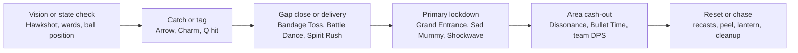
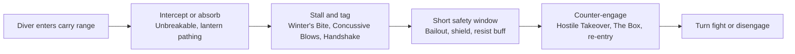

# Ability Synergy and Gameplay Fun in League of Legends

## Executive Summary

The most durable source of fun in *League of Legends* is not raw spell power but **synergy structure**: a player uses one ability to create a state, another to convert that state into damage, space, or safety, and a third to modulate commitment through chase, peel, reset, or reposition. Riot’s own design writing points to the same ingredients from several angles: gameplay should be clear and hierarchically readable, mana and other costs should create ebb-and-flow pacing and meaningful stakes, durability should preserve larger windows for skill expression, and complex champions should be tuned for long-term mastery rather than immediate dominance. Across game-design research, the same pattern appears under different names: MDA explains why mechanics are only valuable when they create satisfying dynamics and aesthetics; self-determination theory ties enjoyment to autonomy, competence, and relatedness; GameFlow and Flow emphasize clear goals, immediate feedback, control, and challenge-skill fit. citeturn17view0turn17view1turn17view2turn17view3turn23view0turn23view2turn24search2turn23view3

A useful taxonomy of League abilities is therefore **functional rather than slot-based**. The core families are targeting and delivery, timing and state, crowd control and interruption, mobility and reposition, resources and cadence, scaling and conditional payoff, space and information control, and ally enablement. The most enjoyable kits usually span several families at once. Ahri’s Charm is a setup tool, Orb of Deception and Fox-Fire are conversion tools, and Spirit Rush is the commitment modulator; Braum’s passive, shield, and ally jump produce a similarly complete loop, but from a defensive angle; Orianna’s Ball turns remote positioning itself into a source of both setup and payoff. citeturn8search0turn6view0turn5view1turn5view0turn8search1turn8search2

From a design standpoint, the best League synergies are **readable, costly enough to matter, and open enough to answer**. They reward sequencing and coordination without reducing the exchange to an unavoidable script. The best examples in the current game preserve branching after success: Lee Sin can turn a landed Q into pick, kick-peel, isolation, or escape; Braum can convert allied focus into a stun or use the same kit to nullify a dive; Renata can transform a losing fight into a bailout race; Orianna can convert ally movement into delayed area control. The common failure modes are the inverse: too much hidden state, too many jobs compressed into one spell, too much safety attached to poke or sustain, and too little time for the losing side to act. citeturn5view0turn6view0turn5view1turn8search2turn17view0turn17view1turn17view3

## Research Basis and Analytical Lens

This report is a design synthesis built primarily from official materials by entity["company","Riot Games","game developer"]—current champion ability pages, patch notes, and dev posts—and interpreted through four long-standing frameworks from game studies and HCI. MDA is especially useful here because League’s ability text is only the **mechanics** layer; the interesting part for a designer is the **dynamic** behavior that emerges when those abilities are sequenced under pressure, and the resulting **aesthetic** outputs such as outplay, rescue, tension, tempo, or teamfight climax. SDT adds the motivational lens of autonomy, competence, and relatedness; GameFlow adds concentration, challenge, skills, control, clear goals, feedback, immersion, and social interaction; Flow theory frames fun as sustained challenge matched to skill under conditions of immediate feedback and perceived control. citeturn23view0turn23view2turn24search2turn23view3

Useful official ability-description links to inspect alongside this analysis are Ahri citeturn2search0, Lee Sin citeturn5view0, Orianna citeturn5view1, Thresh citeturn8search1, and Renata Glasc citeturn8search2. For visual examples of Riot’s standards for readability and complexity, the “Clarity in League” article and “Champion Insights: Hwei” are also particularly useful because they show Riot explicitly discussing visual hierarchy, noise reduction, and the need to make a high-skill-ceiling kit more legible. citeturn17view0turn17view5

## Taxonomy of Ability Mechanics

League’s ability language becomes easier to reason about when treated as a set of interoperable modules. What matters most for fun is not only **what a spell does**, but **what kinds of other spells it can confirm, protect, threaten, or reset**. The taxonomy below is therefore a functional map of current League ability design rather than a canonical Riot classification. citeturn17view0turn17view1turn23view0

| Mechanic family | What it includes | Why it matters for fun | Representative official examples |
|---|---|---|---|
| Targeting and delivery | Self-cast, hostile point-and-click, ally-targeted, line/cone/circle skillshots, ground-targeting, pass-through projectiles, recasts | Determines commitment, reliability, and how much downstream certainty the first input creates | Ahri E line skillshot; Lee Sin Q hit-confirm recast; Orianna Q ground delivery; Thresh W ally click-dash |
| Timing and state | Passives, persistent or toggle-like effects, delayed detonations, channels, stance swaps, form changes, empowered windows, takedown recasts | Creates pacing, planning, and “when” skill rather than only “where” skill | Amumu W persistent drain; Miss Fortune R channel; Elise R form swap; Ahri R recasts |
| Crowd control and interruption | Slow, root, stun, charm, fear, taunt, sleep, silence, suppression, knockup, knockback, pull, forced movement, anti-dash or channel interruption | Supplies setup verbs and lets designers vary control without always defaulting to a simple stun | Ashe slow/stun; Braum stun/knockup; Ahri charm; Fiddlesticks fear/silence; Malzahar suppression |
| Mobility and reposition | Dashes, lunges, ally dashes, self-pull, kick displacement, arena creation, teleports/blinks | Controls agency, escape valves, engage threat, highlight potential, and counterplay burden | Spirit Rush; Safeguard; Rakan W/E; Jarvan IV Q→E and R; Kassadin R teleport |
| Resources and cadence | Mana, Energy, Heat, Fury, courage/remount, fixed-shot cadence, cooldowns, charges, resets, refunds | Governs tempo and the cost of fishing for high-value outcomes | Lee Sin Energy refunds; Rumble Heat; Renekton Fury; Kled remount courage; Jhin four-shot cadence |
| Scaling and conditional payoff | Current/missing/max-health damage, repeated-hit ramp, on-hit synergies, passive marks, empowered states, true-damage riders, hybrid payoff conditions | Rewards sequencing and target selection rather than flat DPS repetition | Elise Q high/low-health contrast; Lee Sin Q2 missing-health damage; Orianna passive ramp; Braum passive; Amumu passive |
| Space, zoning, and information | Persistent fields, traps, scouting, reveals, walls, summoned units, occupancy pressure, terrain manipulation | Makes battles about routes and safety, not only HP trading | Ashe Hawkshot; Miss Fortune E; Orianna W field; Heimerdinger turrets; Jarvan IV arena; Lee Sin E reveal |
| Ally enablement | Shields, resist buffs, ally reposition, delayed death, attachment, aura grants, cooperative proc systems | Turns solo execution into team dynamics and makes support play active rather than passive | Braum W/E; Thresh lantern; Orianna E attach; Renata W/E; Rakan E; Jarvan IV E aura |

The examples above are synthesized from Riot’s current champion pages and design posts. Targeting, movement, and ally-enablement examples are drawn especially from Ahri, Amumu, Ashe, Braum, Lee Sin, Orianna, Thresh, Rakan, Renata Glasc, Elise, Jarvan IV, Miss Fortune, Heimerdinger, and Jhin; the cadence/resource logic is reinforced by Riot’s explicit “Manaless Champions” design explanation. citeturn8search0turn27search0turn3search0turn6view0turn5view0turn5view1turn8search1turn9view1turn8search2turn7search2turn9view2turn9view3turn7search1turn10search0turn17view1

One reason League remains so rich after many seasons is that its crowd-control vocabulary is far broader than “hard CC versus soft CC.” In functional terms, it includes movement impairment, action denial, forced behavior, forced movement, delayed denial, and interruption. Riot’s current pages show this range clearly through entity["fictional_character","Fiddlesticks","league of legends"] fear and center-hit silence, entity["fictional_character","Malzahar","league of legends"] suppression, entity["fictional_character","Galio","league of legends"] taunt, and entity["fictional_character","Lillia","league of legends"]’s drowsy-into-sleep ultimate. That breadth is central to fun because it lets designers create many different “setup feelings” rather than solving every combo with the same stun template. citeturn19search0turn19search1turn22search0turn20search0

Mobility is equally varied. Some movement tools traverse space along a path and can be read or interrupted; others re-anchor to allies or targets; some are true teleports. entity["fictional_character","Kassadin","league of legends"] is useful as a clean reference here because Riot’s official page distinguishes Null Sphere’s ability to interrupt channels from Riftwalk’s teleport movement and escalating mana cost. That separation is good design language: “closing distance,” “breaking a channel,” and “ignoring terrain” are different verbs and should not be casually merged into one low-cost spell. citeturn26search0turn5view0turn9view1turn8search0

Transformations and summons are especially potent synergy multipliers because they change what follow-ups are legal. Elise’s form swap converts ranged pick tools into melee execution while preserving spiderling-linked follow-through, and entity["fictional_character","Heimerdinger","league of legends"] externalizes power into persistent turrets that keep changing local threat even after the initial cast. The fun benefit is not just variety; it is **branching continuation**, where the first successful action opens several viable second actions instead of a single mandatory route. citeturn7search2turn7search1turn23view0

## Synergy Archetypes and Champion Breakdowns

The most common League interaction pattern is **setup → conversion → modulation**. A spell marks a target, fixes spacing, or narrows movement; a second spell cashes out that state into damage, zone value, or safety; then a third spell decides whether to chase, peel, or reset. Not every champion owns all three steps alone, but the most memorable combinations do. citeturn8search0turn5view0turn5view1turn6view0turn8search2

### Combo Chains and Hit Confirmation

Self-contained combo chains are most fun when early inputs reduce uncertainty without fully solving the encounter. Ahri is an exemplary case: Charm damages and disarms a target’s movement choice by forcing them toward her and even stopping movement abilities, Orb of Deception creates a two-pass damage check with a return true-damage line, Fox-Fire adds near-target lock-on, and Spirit Rush gives up to three dashes with takedown-based additional recasts. The result is not a binary “hit E or miss E” character. It is a branching kit in which landing E creates a menu of burst, chase, angle correction, or disengage decisions. Elise follows the same structure with a different skill signature: Cocoon is the hard confirmation tool, Human-form Q/W soften the target from range, then Spider Form converts that setup into lunge-and-execute pressure. Amumu is the lower-complexity tank analogue: Bandage Toss commits him, W/E keep contact valuable, and Curse of the Sad Mummy turns arrival into an AoE lockdown window for allied magic follow-up. citeturn8search0turn7search2turn27search0

### Soft and Hard CC Follow-Ups

Soft/hard CC interlocks are some of the best “social fun” generators in League because they distribute authorship of the combo. Ashe’s Frost Shot passive and Volley create sticking power and chip pressure over time, Hawkshot reduces uncertainty before a commitment, and Enchanted Crystal Arrow creates an obvious long-range initiation point. Braum converts that initiation into cooperative lockdown because once Concussive Blows starts, his allies can contribute basic attacks toward the stun. This means the combo is neither fully solo nor fully scripted: Ashe starts the problem, Braum and the team solve it, and the defenders still understand what is happening and where the answer space lies. citeturn3search0turn6view0turn17view0

### Displacement and Area Control

Displacement plus area-control is League’s most reliable teamfight amplifier because it changes geometry before it changes damage. Orianna’s Ball can be moved directly with Command: Attack or attached to an ally with Command: Protect. Once delivered, Command: Shockwave pulls enemies toward that point after a short delay, and Command: Dissonance overlays the same location with an ally-speed/enemy-slow field. The fun here comes from delayed inevitability: the play becomes legible before it becomes lethal. At the team level, the same logic appears when entity["fictional_character","Jarvan IV","league of legends"] compresses space through Q→E knock-up and Cataclysm so that entity["fictional_character","Miss Fortune","league of legends"] can layer Make It Rain and Bullet Time into a region that is suddenly much harder to leave. The key design lesson is that displacement is rarely most satisfying as raw CC; it is most satisfying as **positional precondition**. citeturn5view1turn9view2turn9view3

### Mobility and Burst

Mobility is most fun when it is conditional, contextual, or costly. Lee Sin remains a gold-standard example because almost every leg of the kit attaches to a different condition. Sonic Wave must hit first; Resonating Strike then converts that success into missing-health damage; Safeguard creates positional branching through ally targeting; Tempest adds reveal and slow; Dragon’s Rage transforms contact into peel, isolation, or multi-target displacement. Because Flurry returns Energy only after using an ability and weaving attacks, the kit also encourages rhythm rather than pure spam. Rakan shows the support-side version of the same principle: Battle Dance needs an ally anchor, The Quickness turns touch into charm, and Grand Entrance converts movement into knock-up. Both kits are satisfying because mobility is not a free bypass of interaction; it is the reward for setting up the right state. citeturn5view0turn9view1turn17view1

### Poke, Engage, and Zoning

Poke is most enjoyable when it informs later commitment rather than replacing it. Ashe’s Volley and Hawkshot reduce uncertainty before Arrow; Miss Fortune’s Make It Rain both reveals and slows an area, making later Bullet Time or allied engage much easier to cash out; and entity["fictional_character","Heimerdinger","league of legends"]’s turrets create continuous occupancy pressure that makes some paths expensive before a fight formally starts. In each case, the “fun” does not come from isolated chip damage. It comes from converting repeated low-commitment information or pressure into a later high-commitment action with better odds of success. Zoning is therefore best understood not as area damage but as **future combo assistance**. citeturn3search0turn9view3turn7search1

### Sustain and Peel

Protective synergies are fun when they are active and directional rather than passive and invisible. Braum’s Unbreakable asks the player to choose an intercept angle, Winter’s Bite starts the passive stun race, and Stand Behind Me decides who gets cover and resist sharing. Renata’s Bailout is even more interesting because it makes support play morally tense: the ally only really “survives” if they can convert the temporary lease on life into a takedown, while Handshake and Hostile Takeover punish over-commitment from the enemy side. Thresh’s Dark Passage is one of League’s best cooperative mechanics because it is not merely a save; it is a player-readable reposition offer, which means it can enable collapse, escape, or bait. Rakan’s E belongs to the same family, but with higher movement tempo and less object permanence. citeturn6view0turn8search2turn8search1turn9view1

### Resource Trade-Offs

Resources determine whether synergy feels like a climax or like background noise. Riot explicitly notes that mana paces lane phase, creates breaks in the action, and preserves the importance of high-stakes casts. That same logic appears in specialized resources. Lee Sin’s Energy is earned back through correct ability-attack sequencing. entity["fictional_character","Rumble","league of legends"]’s Heat amplifies basic abilities in Danger Zone but threatens Overheat downtime. entity["fictional_character","Renekton","league of legends"]’s Fury saves power for one especially meaningful empowered cast. entity["fictional_character","Kled","league of legends"] turns aggression into remount safety through courage. entity["fictional_character","Jhin","league of legends"] converts fixed-shot cadence into visible pacing and burst windows. The underlying pattern is consistent: resources are most fun when they shape **tempo and commitment**, not when they merely punish keypress frequency. citeturn17view1turn5view0turn13search0turn13search1turn14search0turn10search0

The two flow shapes below abstract these interactions. The first is a catch-to-engage chain; the second is a peel-to-reversal chain built out of defensive support tools. They are generalized from the official kits above rather than intended as one fixed composition. citeturn3search0turn9view1turn5view1turn27search0turn9view3turn6view0turn8search2turn8search1

## Player Experience Effects

Riot’s clarity doctrine is one of the best explanations for why some synergies feel exhilarating and others feel cheap. Riot defines clarity as the ability to understand what is happening and respond, with explicit priorities of clear gameplay communication, preserved hierarchy, and minimal noise. That means synergy is never only a numbers problem. It is also a **readability problem**. Orianna feels fairer than her output might suggest because the Ball’s position is public and central. Braum’s shield declares its active angle. Thresh’s lantern is a visible object with a clear invitation structure. When setup and payoff are both externally legible, the defending player can still feel challenged rather than robbed. citeturn17view0turn5view1turn6view0turn8search1

The motivational literature aligns closely with this. SDT argues that autonomy, competence, and relatedness independently predict enjoyment and future play, while GameFlow highlights concentration, challenge, skills, control, clear goals, and immediate feedback. League synergies are fun precisely when they satisfy those needs. A successful Lee Sin combo feels skillful because the player chose a route among multiple viable routes. A lantern save feels relational because one player offered the reposition and another accepted it in time. A Braum passive proc feels collaborative because value is co-authored by allied attention. These are not accidental emotions; they are the dynamic outcomes of kits built to produce **branching control plus social validation**. citeturn23view2turn24search2turn5view0turn8search1turn6view0

Flow theory adds a final piece: challenge-skill fit under immediate feedback. Riot’s durability update explicitly aimed for longer fights and larger windows for skill expression. That is important because layered synergies are only fun if opponents can still act inside them. If every reliable tag instantly leads to unavoidable death, the player no longer experiences a dynamic exchange; they experience a solved script. League is usually at its most satisfying when synergy creates a temporary advantage in information, tempo, or geometry—enough to reward the initiator, but not enough to remove the defender from meaningful decision-making altogether. citeturn17view2turn23view3turn24search2

MDA also helps explain the social satisfaction of coordinated kits. The raw mechanics of Orianna E, Thresh W, Renata W, Braum passive, or Rakan E are not individually extraordinary from a systems standpoint; what makes them memorable is the **aesthetic output** of rescue, turn, bait, chase, or synchronized collapse. In game-design terms, League gets disproportionate fun value whenever one spell changes the meaning of another player’s next choice rather than merely adding damage to it. That is why ball delivery, lantern saves, bailout races, and cooperative stun stacks are richer than simple stat inflation. citeturn23view0turn5view1turn8search1turn8search2turn6view0turn9view1

The same features that create this richness also create balance fragility. Riot notes that even easy champions typically gain win rate over early games and that some high-mastery kits keep improving much longer; Riot’s Hwei commentary similarly describes the deliberate pursuit of a high skill ceiling together with stronger visual communication. For a designer, the implication is straightforward: the more a kit branches after a successful input, the more likely it is to develop a long mastery tail, pro skew, or “it felt unfair” counterplay confusion unless clarity and tuning are unusually disciplined. citeturn17view3turn17view5turn17view0

## Design Patterns and Recommendations

The most reliable pattern for fun-maximizing synergy is to assign each spell a **primary job** and let fun emerge from the relation among jobs rather than inflating each spell into a universal answer. Riot’s own clarity and balance writing supports this indirectly: preserve hierarchy, reduce noise, keep misses meaningful, and respect long-tail mastery. The recommendations below translate those principles into concrete ability-design practice. citeturn17view0turn17view1turn17view3

| Design goal | Do | Don’t | Tuning cues |
|---|---|---|---|
| Make combos readable | Give one spell a visible setup role and another a visible payoff role | Collapse engage, hard CC, burst, and escape into one low-risk cast | Telegraph strength, cast time, missile width, delay windows |
| Make mobility expressive | Gate dashes or teleports behind hit-confirm, ally anchor, or resource state | Give unconditional engage and unconditional exit on the same short cycle | Recast windows, post-cast lockout, reset condition severity |
| Make support synergistic | Use ally-click, attachment, intercept angles, or short rescue windows | Hide power in passive auras or invisible auto-value effects | Shield duration, ally interaction window, spatial affordances |
| Preserve pacing | Use mana, heat, fury, energy, or cadence limits to create real tempo choices | Allow safe poke, sustain, and setup to coexist without meaningful breaks | Cost curves, cooldown parity, refund rules, state decay |
| Preserve counterplay | Enable answers at multiple skill levels: spacing, body-blocking, cleanse timing, punish windows | Depend on one narrow answer only, especially if it requires encyclopedic knowledge | Overlap duration, noise budget, state markers, recovery window |
| Encourage emergence | Let one spell improve many different allied follow-ups | Make the “correct” combo so rigid that creativity disappears | Path flexibility, target ambiguity, multi-role utility without full redundancy |

These recommendations are strongest when phrased as a small set of design dos and don’ts. **Do** spend reliability budget before damage budget: the more certain the setup, the less raw follow-up power it should carry. **Do** make failure states informative: a missed Charm, hook, or Cocoon should cost tempo or position so the player learns through consequence. **Do** reserve rule-breaking for ultimates, expensive states, or windows with obvious telegraph. **Don’t** let a single spell both start and finish the exchange unless the opportunity cost is correspondingly extreme. **Don’t** make support value automatic; the most engaging supportive spells are the ones that ask both players to cooperate and both teams to recognize the moment. citeturn17view0turn17view1turn8search0turn8search1turn7search2turn8search2

A practical tuning guideline is to think of synergy on three budgets at once. The **clarity budget** covers legibility, hierarchy, and state marking. The **certainty budget** covers how often a setup produces reliable conversion. The **mastery budget** covers how much additional value experts can unlock through routing, cancel timing, target selection, or reset control. If all three budgets are high at once, balance becomes brittle very quickly. If one is intentionally kept moderate, the others can safely rise. Riot’s own long-term-balance framing for new champions is effectively an argument for respecting that mastery budget instead of pretending it does not exist. citeturn17view3turn17view0turn17view5

## Pitfalls and Mitigations

The first major failure mode is **frustration through low-answer chains**. This happens when early setup is too reliable, follow-up is too front-loaded, and the victim’s best answer occurs before the interaction is even legible. The mitigation is not simply “reduce damage.” It is to rebalance the sequence: slow the first setup, narrow its hitbox, shorten the overlap of layered control, or make the payoff more positional and less instantly terminal. Riot’s clarity doctrine and durability patch both push in this direction by valuing reaction windows and skill expression over instantaneous certainty. citeturn17view0turn17view2

The second failure mode is **opacity**: hidden passive power, overloaded state exceptions, unclear object ownership, or visuals that fail to communicate which piece of the combo matters most. Riot explicitly warns against both poor hierarchy and excessive visual noise, and Riot’s Hwei notes show the same concern from the opposite angle—high complexity had to be paired with brighter, more recognizable ability communication. Mitigation here is formal rather than numerical: fewer exception cases, stronger VFX hierarchy, better positional state markers, cleaner sound cues, and a willingness to trim secondary riders from already-important spells. citeturn17view0turn17view5

The third failure mode is **combo bloat**. A bloated kit gives too many spells several top-tier jobs at once: setup, mobility, safety, waveclear, burst, and reset. Such kits usually read as “always threatening,” which sounds powerful but often produces poorer long-term fun because the right answer becomes passive avoidance. The best mitigation is a hard role assignment per spell. If one spell is the engager, another should probably be the safer converter rather than a second equally reliable engager. If a spell already creates movement plus CC, its damage or safety rider should be restrained. citeturn17view0turn17view3turn5view0turn9view1

The fourth failure mode is **balance fragility through mastery skew**. Riot’s balance post makes the point clearly: some champions keep gaining effectiveness deep into their play histories, and unhealthy mechanics may only reveal themselves once the full player base stress-tests them. The design implication is to treat unusually branchy, combo-rich kits as long-tail systems from day one. Tune for their mature state, not their launch confusion, and be willing to remove fundamentally unhealthy mechanics instead of sanding numbers forever. Riot explicitly cites cases where a mechanic itself proved not healthy enough for long-term retention. citeturn17view3

The fifth failure mode is **degenerate pacing**, especially when safe poke, sustain, and control lack meaningful cost. Riot’s mana discussion is especially valuable here because it frames resource systems as dramatic structure, not just balance levers: action should have breaks, safe patterns should not be freely repeated, and high-impact misses should matter. The mitigation is therefore not always “add mana.” It can be Heat, Fury, cadence, charges, self-exposure, destructible summons, or a stronger post-cast vulnerability window. What matters is that the synergy remains a deliberate commitment rather than a permanent background condition. citeturn17view1turn13search0turn13search1turn14search0turn10search0

## Representative Champion Comparison

The table below compares ten representative champions across the attributes most relevant to synergy design. The goal is not tier ranking; it is to show how different kits package setup, payoff, modulation, and counterplay.

| Champion | Mechanics used | Primary synergy type | Common combo order | Skill floor | Skill ceiling | Counterplay options |
|---|---|---|---|---|---|---|
| **entity["fictional_character","Ahri","league of legends"]** | Line skillshot CC; burst follow-up; recast dashes; passive healing | Pick into mobility burst | E → Q → W → R reposition/finish | Medium | High | Sidestep Charm; hold mobility or cleanse; punish once R charges are spent |
| **entity["fictional_character","Amumu","league of legends"]** | Gap-close stun; persistent area damage; AoE stun; passive magic amplification | Engage chain into team follow-up | Q → W → R → E | Low | Medium | Dodge Q; spread before R; disengage after first commit |
| **entity["fictional_character","Ashe","league of legends"]** | Passive slow; cone poke; map vision; global stun | Poke plus engage plus info control | W poke/scout → R engage → autos/Q | Medium | High | Angle away from Arrow; punish low mobility; deny follow-up window |
| **entity["fictional_character","Braum","league of legends"]** | Cooperative passive stun; slow projectile; ally leap; projectile wall; knockup | Peel plus on-hit collaboration | Q → autos/passive stacks → E; R to disengage or extend | Low | Medium-High | Avoid 4-stack races; bait E; disengage before passive completes |
| **entity["fictional_character","Lee Sin","league of legends"]** | Hit-confirm recast; ally dash; reveal/slow; kick displacement; Energy refunds | Mobility burst and displacement | Q1 → reposition with W → R → Q2 or peel kick | High | Very high | Sidestep Q; track W/R cooldowns; punish over-entry |
| **entity["fictional_character","Orianna","league of legends"]** | Remote-object control; shield attach; speed/slow field; delayed pull | Displacement plus area control | Q or E on diver → R → W | Medium | Very high | Track Ball position; spread out; force shield early |
| **entity["fictional_character","Thresh","league of legends"]** | Hook; ally reposition; displacement; persistent zone | Pick, peel, and ally routing | Q hit → Q2 or E → R; W allies in/out | Medium | Very high | Stand behind minions; punish missed Q; deny lantern usage paths |
| **entity["fictional_character","Rakan","league of legends"]** | Ally dash; AoE knockup; contact charm; shielded re-entry | Engage chain with escape modulation | E ally → R → W → Q → E out | Medium | High | Maintain spacing; interrupt entry timing; punish after first cycle |
| **entity["fictional_character","Renata Glasc","league of legends"]** | Root-throw displacement; shield/slow missiles; delayed-death buff; berserk wave | Counter-engage and bailout support | E slow/shield → Q throw or R → W bailout carry | Medium | High | Spread versus R; burst through failed Bailout; punish long cooldowns |
| **entity["fictional_character","Elise","league of legends"]** | Form swap; stun/reveal; current-vs-low-health Q pair; lunge; summonlings | Pick into dive and execution | Human E → Q/W → R → Spider Q/W | Medium | Very high | Dodge Cocoon; punish after Rappel; stall burst window |

This comparison combines Riot’s official ability texts and role/difficulty tags with design inference. “Common combo order” is illustrative rather than exhaustive; “skill floor” reflects how quickly a player can generate baseline value, while “skill ceiling” reflects branching, route density, positional burden, and timing sensitivity. The counterplay column is derived from Riot’s clarity principles together with the explicit mechanics on each official page. citeturn8search0turn27search0turn3search0turn6view0turn5view0turn5view1turn8search1turn9view1turn8search2turn7search2turn17view0turn17view3

Taken together, these examples point to the same design conclusion: synergistic abilities maximize fun when they are **legible, conditional, multi-stage, and socially combinable**. The sweet spot is not maximum combo length or maximum spectacle. It is the moment where one successful action makes several later actions newly meaningful—for both teams. citeturn17view0turn23view0turn23view2turn24search2turn23view3